# PROJECT_STRUCTURE.md

# AI-Powered Lead Generation & Cold Outreach Platform — Technical Blueprint

> **Purpose:** This document is the implementation blueprint for a solo developer (and for an AI coding agent that will build the app file-by-file). It defines architecture, structure, data model, APIs, integrations, security, cost controls and build phases. It intentionally contains **no full application code**, only schemas, contracts and small illustrative snippets.
>
> **Version note:** Library versions are intentionally not pinned here. Verify current stable versions (and current API pricing/quotas/terms of Google, Gemini, Pinecone, hosting vendors) at install time. Items marked **⚠ VERIFY** depend on third-party terms that change.

---

## Table of Contents

1. [Project Overview](#1-project-overview)
2. [Architecture](#2-architecture)
3. [Tech Stack](#3-tech-stack)
4. [Cost & Performance Optimization Playbook](#4-cost--performance-optimization-playbook)
5. [Folder Structure](#5-folder-structure)
6. [Route Structure](#6-route-structure)
7. [Database Schema](#7-database-schema)
8. [API Architecture](#8-api-architecture)
9. [Google OAuth Architecture](#9-google-oauth-architecture)
10. [Gmail Architecture](#10-gmail-architecture)
11. [Google Sheets Architecture](#11-google-sheets-architecture)
12. [Lead Generation Architecture](#12-lead-generation-architecture)
13. [Cold Email Architecture](#13-cold-email-architecture)
14. [Inbox Architecture](#14-inbox-architecture)
15. [AI Architecture](#15-ai-architecture)
16. [Redis Architecture](#16-redis-architecture)
17. [Queue Architecture](#17-queue-architecture)
18. [Pinecone / Vector Architecture](#18-pinecone--vector-architecture)
19. [Security](#19-security)
20. [Compliance Safeguards](#20-compliance-safeguards)
21. [Environment Variables](#21-environment-variables)
22. [Data Flow Diagrams](#22-data-flow-diagrams)
23. [State Management, Validation, Errors, Logging, Analytics, UI](#23-cross-cutting-concerns)
24. [Development Phases](#24-development-phases)
25. [Testing Strategy](#25-testing-strategy)
26. [Deployment Architecture](#26-deployment-architecture)
27. [Future Scalability](#27-future-scalability)
28. [Package / Dependency Recommendations](#28-package--dependency-recommendations)
29. [Open Decisions & Risks](#29-open-decisions--risks)

---

## 1. Project Overview

A personal-use SaaS-style dashboard for freelance outreach, made of **three independent modules** sharing only a thin platform layer (auth, DB, Redis, logging, Google connection).

| Module | Route | Needs Google? | Needs AI? | Needs Redis/Worker? | Standalone value |
|---|---|---|---|---|---|
| **1. Lead Generator** | `/dashboard/leads` | Only for Sheets export (optional) | Optional enrichment | No | Search → clean lead list → CSV/Excel/Google Sheet |
| **2. Cold Email Campaigns** | `/dashboard/campaigns` | Gmail send (required), Sheets (optional) | Optional personalization | **Yes** (queue + limits) | CSV/Sheet → controlled sending → status sync |
| **3. Inbox Opportunity Dashboard** | `/dashboard/inbox` | Gmail read (required) | **Yes** (classification) | Light (sync state/locks) | Surface potential clients from Gmail |

### Independence rules (enforced, not just documented)

1. **No module imports another module.** Cross-module needs go through `server/platform` or `server/integrations` (shared, module-agnostic).
2. **Campaigns never require `Lead` rows.** A `CampaignLead` stores a **snapshot** of recipient data (email, business name, etc.) with an *optional* `leadId` back-reference. Source can be Google Sheet, CSV, or the Leads module.
3. **Inbox never requires campaigns.** It only needs a Gmail-connected account.
4. **Google scopes are requested incrementally per module** (see §9). A user who only uses Lead Generator never grants Gmail access.
5. **Enforced with tooling:** `dependency-cruiser` or `eslint-plugin-boundaries` rule in CI forbids `modules/leads` ↔ `modules/campaigns` ↔ `modules/inbox` imports.

### Non-goals

- No auto-replies. No autonomous business decisions. AI never sends anything.
- No bypassing Gmail limits/spam controls. No unauthorized scraping.
- No fabricated open/click tracking (no tracking pixels in MVP).

---

## 2. Architecture

### 2.1 Layered architecture

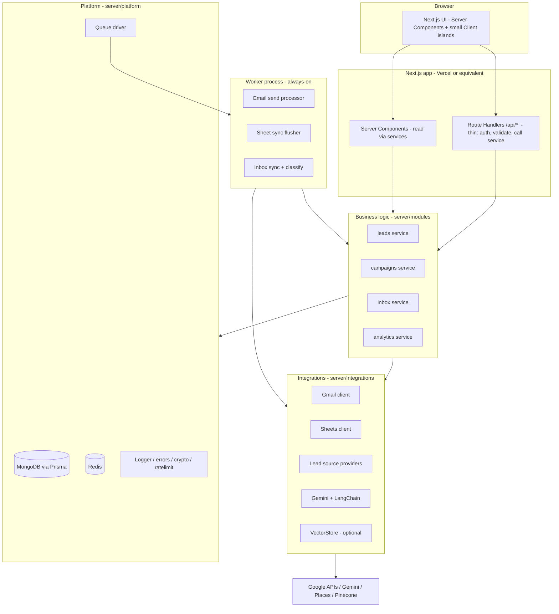

### 2.2 Layer responsibilities

| Layer | Allowed to do | Forbidden |
|---|---|---|
| `app/` (routes, pages) | Routing, auth gate, parse request, call a service, shape response | Business logic, direct DB/Redis/Google calls |
| `features/*` (UI) | Components, hooks, client-side forms, query keys | Server-only imports, secrets |
| `server/modules/*` | Business rules, orchestration, authorization checks, DB via repositories | Rendering, HTTP concerns |
| `server/integrations/*` | Wrap external APIs (retry, mapping, error normalization, quota-awareness) | Business decisions |
| `server/platform/*` | DB client, Redis, queue, logger, crypto, errors, rate limiter | Domain knowledge |
| `worker/` | Process queue jobs by calling `server/modules` services | Own business logic (just glue) |

### 2.3 Key architectural decisions (summary)

| Decision | Choice | Why |
|---|---|---|
| API style | **Route Handlers** as the primary API; Server Actions only for tiny settings forms | Documentable, testable, usable by TanStack Query and the worker |
| Auth | **Auth.js (Google provider, minimal scopes, JWT sessions)** for *login*; **custom incremental-consent flow** for Gmail/Sheets stored in `GoogleAccount` | Separates "who are you" from "what Google access did you grant" |
| Queue | **BullMQ + standard Redis + 1 small always-on worker** (behind a `QueueDriver` interface) | See §17; BullMQ needs persistent TCP, so not on serverless functions |
| Source of truth | **MongoDB** (Redis = ephemeral/coordination; Sheets = mirror/UX) | Survives Redis loss and manual sheet edits |
| Duplicate protection | **4 layers**: Mongo unique index → `ContactLedger` → atomic status claim → Redis lock | A single layer is never trusted |
| AI | **Gemini Flash-class model** via LangChain structured output, **pre-filtered + batched + cached + budget-capped** | Cost control (§4) |
| Vector DB | Optional, behind `VectorStore` interface, **off by default** | Not needed for MVP |

---

## 3. Tech Stack

| Area | Choice | Notes |
|---|---|---|
| Framework | Next.js (App Router) + TypeScript (strict) | Server Components by default |
| UI | React, Tailwind CSS, shadcn/ui (Radix primitives), `lucide-react` | Copy-in components = no heavy UI runtime |
| Animation | GSAP (+ `@gsap/react`), Lenis | Lazy-loaded, reduced-motion aware (§23.8) |
| Server state | TanStack Query | Only for client-interactive data |
| Tables | TanStack Table + TanStack Virtual | Virtualize lists > ~100 rows |
| Forms/validation | React Hook Form + Zod | Same Zod schemas server-side |
| DB | MongoDB (Atlas) + Prisma | Prisma-on-Mongo constraints in §7.1 |
| Auth | Auth.js (NextAuth v5) + `google-auth-library` for Google API tokens | |
| Google | `googleapis` (or lighter `@googleapis/gmail` + `@googleapis/sheets`) | Prefer scoped packages to cut bundle/cold-start |
| AI | `@langchain/google-genai`, `@langchain/core`, Zod | Used only where it adds value (structured output, batching) |
| Redis | `ioredis` | Standard Redis protocol (BullMQ requirement) |
| Queue | BullMQ | Worker in separate process |
| Vector | `@pinecone-database/pinecone` | Optional |
| Logging | `pino` | JSON logs with request IDs |
| Testing | Vitest, Playwright, MSW, Testcontainers | §25 |
| Quality | ESLint, Prettier, dependency-cruiser, Husky + lint-staged | |

---

## 4. Cost & Performance Optimization Playbook

This is a first-class requirement. Each rule below is referenced again in the relevant module sections.

### 4.1 Cost model at a glance (solo-developer scale)

| Cost center | Main driver | Optimization (summary) | Expected scale of spend |
|---|---|---|---|
| **Gemini** | Tokens | Pre-filter → batch → truncate → cache → cheapest capable model → monthly budget cap | Cents–low dollars/month |
| **Places / lead APIs** | Requests × field SKUs | Field masks, result caching, "preview before enrich", per-search cap | Biggest *variable* cost; control via caps |
| **Gmail API** | Quota units (not money) | `history.list` incremental sync, metadata-first, batch | Free; quota-bound |
| **Sheets API** | Quota (60 writes/min/user class limits) | Batched writes via outbox | Free; quota-bound |
| **MongoDB Atlas** | Storage/IOPS | Store metadata not mailbox, TTL indexes, projections, indexes | Free tier → small paid |
| **Redis** | Memory / commands | Standard Redis (flat price) for BullMQ; short TTLs; no polling loops | Flat low monthly |
| **Worker** | Always-on process | One small instance, concurrency 1–2 | Flat low monthly |
| **Hosting** | Function invocations/bandwidth | Static/cached pages, ISR where possible, no polling | Depends on plan |

> ⚠ VERIFY: current prices/free tiers for all of the above. Do not hard-code assumptions.

### 4.2 AI cost rules (the "AI Cost Ladder")

Always attempt the cheapest step first; only escalate when needed.

| Step | Technique | Effect |
|---|---|---|
| 0 | **Don't call AI** if a deterministic rule decides (own sent mail, `noreply@`, `List-Unsubscribe` newsletters, Gmail `category:promotions/social/updates`, bounce notices, already classified) | Removes ~70–90% of inbox volume |
| 1 | **Template-first personalization**: deterministic merge fields (`{{businessName}}`, `{{category}}`, `{{city}}`); AI only writes **1–2 optional sentences** (observation/opening) | 10–20× fewer output tokens than full-email generation |
| 2 | **Batch**: classify 10–20 emails per call using one shared system prompt; return a JSON array keyed by id | Amortizes prompt tokens |
| 3 | **Truncate input**: strip quoted replies, signatures, HTML; cap body (e.g., ~1,200–1,500 chars); for personalization send only site `<title>` + meta description + first ~500 chars of homepage text | Caps input tokens |
| 4 | **Cache by content hash** (`sha256(normalizedInput + promptVersion + model)`) in Redis (short TTL) and a Mongo field (permanent for classification) | Never pay twice for the same input |
| 5 | **Model tiering** via config: Flash-Lite-class for classification; Flash-class only for personalization/re-check of low-confidence | Lower cost per call |
| 6 | **Escalate only on low confidence** (e.g., `<0.6`) to a stronger model, max once | Quality where needed |
| 7 | **Structured output + low `maxOutputTokens`** (classification ≈ 60–80 tokens/email) | Prevents verbose responses |
| 8 | **Budget guard**: `AiUsage` collection tracks tokens/calls per user per month; hard cap in `config/limits.ts`; when exceeded, AI features degrade to rules-only / manual and the UI says so | No surprise bills |
| 9 | **Generate at "prepare" time, not send time**; store results in `CampaignLead.personalizedFields`; regenerate only on explicit user action | No repeat generation, previews are free |
| 10 | **Paid-tier privacy**: ⚠ VERIFY whether free-tier Gemini usage may be used for model improvement. Do **not** send inbox content on a tier whose terms allow that | Privacy/cost tradeoff made explicit |

**Estimation formula (put in Settings → AI usage page):**
`monthly_tokens ≈ (emails_after_prefilter / batch_size) × (system_prompt + batch_input + batch_output)`.
Example: 200 inbox emails/day → ~40 after pre-filter → 4 batched calls/day. Personalization: 100 leads/day × ~250 tokens in / ~60 out.

### 4.3 External API call rules

| API | Rule |
|---|---|
| **Gmail read** | Use stored `historyId` + `users.history.list` for incremental sync; initial sync limited by `newer_than:30d` + label/query filters; fetch `format=metadata` (headers + snippet) first; fetch body only for messages that pass the pre-filter; use batch requests; sync only when dashboard opened (stale-while-revalidate, min interval ~5 min) plus optional low-frequency cron |
| **Gmail send** | Only through the queue; custom `Message-ID`; no retries on non-retryable 4xx; exponential backoff on 429/5xx |
| **Sheets** | **Never one call per row.** Use the **outbox + batch flush** (§11.4): `values.batchUpdate` with coalesced updates; read the status column once per batch, not per email |
| **Places / lead providers** | Field masks to request only needed fields; cache search results (respecting provider ToS ⚠ VERIFY); "preview count" before spending on enrichment; per-search `maxResults` cap and daily provider budget in `config/limits.ts` |
| **Website email discovery** | Optional, opt-in per search; respects `robots.txt`; fetch only homepage + `/contact` (max 2–3 pages), 5s timeout, 1 req/sec per domain, results cached on the `Lead` (never refetched within N days) |
| **Gemini** | Per §4.2 |
| **Pinecone** | Off by default; embed only on explicit actions; batch upserts |

### 4.4 Frontend performance rules

- **Server Components by default**; `"use client"` only for interactive islands.
- **Dynamic import** heavy/rare pieces: GSAP plugins, charts, Excel export (`xlsx`), CSV parser, rich editors.
- **Lenis only where it helps** (landing/login/long pages). Dashboard data tables use native scroll (`data-lenis-prevent` on inner scrollers) — Lenis hijacking scroll inside data-heavy panes hurts usability and perf.
- **Virtualize** large tables; **cursor pagination** server-side; never load all leads at once.
- **No polling loops**: use Query `staleTime`, refetch-on-focus, and SSE/short-poll **only** while a campaign is actively running (`refetchInterval` conditional).
- **`next/font`**, `next/image`, route-level code-splitting, `@next/bundle-analyzer` in CI with a budget.
- **Caching:** use Next.js cache primitives with tags for read-heavy, rarely-changing data (analytics aggregates, settings); revalidate on mutation. (Exact API differs between Next versions — ⚠ VERIFY.)
- **Prisma/Mongo:** singleton client, `select` only needed fields, compound indexes matching every list query, no N+1 (batch with `in`).
- **Exports** (CSV/Excel) streamed server-side for large sets; Excel generated lazily.

### 4.5 Data-retention rules (cost + privacy)

- `InboxMessage`: metadata + ≤300-char snippet only; **TTL index** (default 90 days) for `NOT_RELEVANT/GENERAL` rows; opportunities kept until dismissed.
- `EmailLog`: keep; compact `error` text.
- `AiUsage`, `JobRun`: rolled up monthly; raw rows TTL 90 days.
- Redis keys always have TTLs (except BullMQ internal keys).

---

## 5. Folder Structure

Single Next.js repo (not a monorepo) with a **separate worker entrypoint** that reuses `src/server`. Keep one `package.json`; build the worker with `tsup`/`esbuild`.

```text
.
├── PROJECT_STRUCTURE.md
├── .env.example
├── package.json
├── next.config.ts
├── tailwind.config.ts
├── tsconfig.json
├── .dependency-cruiser.cjs          # forbids cross-module imports
├── docker-compose.yml               # local Redis (+ optional local Mongo replica set)
├── Dockerfile.worker                # worker image
├── prisma/
│   └── schema.prisma
├── tests/
│   ├── unit/
│   ├── integration/
│   ├── e2e/                         # Playwright
│   ├── mocks/                       # MSW handlers: gmail, sheets, gemini, places
│   └── fixtures/
├── public/
└── src/
    ├── app/                         # ROUTING ONLY (thin)
    │   ├── (marketing)/
    │   │   └── page.tsx             # landing / redirect
    │   ├── (auth)/
    │   │   └── login/page.tsx
    │   ├── (app)/
    │   │   └── dashboard/
    │   │       ├── layout.tsx       # sidebar, topbar, providers
    │   │       ├── overview/page.tsx
    │   │       ├── leads/
    │   │       │   ├── page.tsx             # lead table
    │   │       │   ├── new/page.tsx         # lead generator
    │   │       │   └── imports/page.tsx     # CSV / URL import history
    │   │       ├── campaigns/
    │   │       │   ├── page.tsx
    │   │       │   ├── new/page.tsx
    │   │       │   └── [id]/
    │   │       │       ├── page.tsx         # overview + controls
    │   │       │       ├── recipients/page.tsx
    │   │       │       └── logs/page.tsx
    │   │       ├── inbox/page.tsx
    │   │       ├── analytics/page.tsx
    │   │       └── settings/
    │   │           ├── page.tsx             # profile & sender identity
    │   │           ├── google/page.tsx      # connections & scopes
    │   │           ├── sending/page.tsx     # limits, warm-up, signature, footer
    │   │           ├── suppression/page.tsx
    │   │           └── ai/page.tsx          # usage, budget, model tier
    │   ├── unsubscribe/[token]/page.tsx     # PUBLIC, no auth
    │   ├── api/                             # Route Handlers (see §8)
    │   │   ├── auth/[...nextauth]/route.ts
    │   │   ├── google/{connect,callback,disconnect,status}/route.ts
    │   │   ├── leads/...
    │   │   ├── campaigns/...
    │   │   ├── inbox/...
    │   │   ├── suppression/...
    │   │   ├── analytics/...
    │   │   ├── unsubscribe/[token]/route.ts
    │   │   ├── cron/[job]/route.ts          # optional, secret-protected
    │   │   └── health/route.ts
    │   ├── layout.tsx
    │   ├── error.tsx
    │   ├── not-found.tsx
    │   └── globals.css
    │
    ├── features/                    # UI + client logic per module (NO server secrets)
    │   ├── leads/
    │   │   ├── components/          # LeadSearchForm, LeadTable, LeadEditDrawer, ExportMenu
    │   │   ├── hooks/               # useLeads, useLeadSearch
    │   │   ├── query-keys.ts
    │   │   └── index.ts
    │   ├── campaigns/
    │   │   ├── components/          # CampaignWizard, TemplateEditor, EmailPreview, ProgressCard, RecipientTable
    │   │   ├── hooks/
    │   │   └── query-keys.ts
    │   ├── inbox/
    │   │   ├── components/          # OpportunityTable, ClassificationBadge, MessageDrawer
    │   │   ├── hooks/
    │   │   └── query-keys.ts
    │   ├── analytics/
    │   └── settings/
    │
    ├── components/                  # Shared, module-agnostic UI
    │   ├── ui/                      # shadcn primitives (button, dialog, table, toast...)
    │   ├── layout/                  # Sidebar, Topbar, PageHeader, ThemeToggle
    │   ├── data-table/              # generic virtualized table
    │   ├── status/                  # StatusBadge, ProgressBar
    │   └── motion/                  # <PageTransition/>, <LenisProvider/>, <Reveal/> (lazy GSAP)
    │
    ├── server/                      # SERVER-ONLY (import "server-only")
    │   ├── modules/                 # BUSINESS LOGIC (one folder per module)
    │   │   ├── leads/
    │   │   │   ├── lead.service.ts          # search orchestration, dedupe, validate, store
    │   │   │   ├── lead.repository.ts
    │   │   │   ├── lead.normalizer.ts
    │   │   │   ├── lead.dedupe.ts
    │   │   │   ├── lead.export.ts           # csv/xlsx
    │   │   │   ├── lead.schemas.ts          # Zod
    │   │   │   └── providers/               # LeadSourceProvider implementations
    │   │   │       ├── provider.interface.ts
    │   │   │       ├── registry.ts
    │   │   │       ├── places.provider.ts   # Google Places API (New) - official
    │   │   │       ├── osm.provider.ts      # OpenStreetMap/Overpass
    │   │   │       ├── directory.provider.ts
    │   │   │       ├── search.provider.ts
    │   │   │       └── csv.provider.ts
    │   │   ├── campaigns/
    │   │   │   ├── campaign.service.ts      # create/start/pause/resume
    │   │   │   ├── campaign.repository.ts
    │   │   │   ├── recipient.import.ts      # sheet/csv/leads -> CampaignLead snapshot
    │   │   │   ├── eligibility.ts           # suppression, ledger, status checks
    │   │   │   ├── send.service.ts          # processOne(): the guarded send pipeline
    │   │   │   ├── limits.service.ts        # daily counter, warm-up ramp
    │   │   │   ├── template.service.ts      # merge-field rendering + validation
    │   │   │   ├── unsubscribe.service.ts
    │   │   │   └── campaign.schemas.ts
    │   │   ├── inbox/
    │   │   │   ├── inbox.service.ts
    │   │   │   ├── inbox.repository.ts
    │   │   │   ├── prefilter.ts             # deterministic rules before AI
    │   │   │   ├── gmail-normalizer.ts
    │   │   │   └── inbox.schemas.ts
    │   │   ├── analytics/
    │   │   │   └── analytics.service.ts     # aggregations + cached rollups
    │   │   └── settings/
    │   │       └── settings.service.ts
    │   │
    │   ├── integrations/            # EXTERNAL API WRAPPERS (module-agnostic)
    │   │   ├── google/
    │   │   │   ├── oauth.ts                 # consent URLs, code exchange, refresh, revoke
    │   │   │   ├── token-store.ts           # encrypt/decrypt, get valid client for user
    │   │   │   ├── gmail.ts                 # list/get/history/send/batch
    │   │   │   ├── sheets.ts                # create/read/batchUpdate helpers
    │   │   │   ├── drive-picker.ts          # picker token helpers
    │   │   │   └── errors.ts                # map Google errors -> AppError
    │   │   ├── ai/
    │   │   │   ├── gemini.ts                # model factory (config-driven tiering)
    │   │   │   ├── prompts/
    │   │   │   │   ├── emailClassification.ts
    │   │   │   │   ├── leadPersonalization.ts
    │   │   │   │   └── emailGeneration.ts   # optional full-draft prompt (off by default)
    │   │   │   ├── chains/
    │   │   │   │   ├── emailClassifier.ts   # batch + structured output
    │   │   │   │   └── emailPersonalizer.ts
    │   │   │   ├── usage.ts                 # AiUsage accounting + budget guard
    │   │   │   └── cache.ts                 # content-hash cache
    │   │   ├── vector/
    │   │   │   ├── vector-store.interface.ts
    │   │   │   └── pinecone.provider.ts
    │   │   └── web/
    │   │       └── site-fetcher.ts          # robots-aware fetch of public pages
    │   │
    │   └── platform/
    │       ├── db/prisma.ts                 # singleton
    │       ├── redis/{client.ts,keys.ts,lock.ts,cache.ts}
    │       ├── queue/{queue.interface.ts,bullmq.driver.ts,queues.ts}
    │       ├── ratelimit/{limiter.ts,policies.ts}
    │       ├── auth/{auth.config.ts,auth.ts,session.ts,authorize.ts}
    │       ├── crypto/{encrypt.ts,hash.ts,tokens.ts}   # AES-GCM, HMAC unsubscribe tokens
    │       ├── errors/{app-error.ts,error-codes.ts,to-response.ts}
    │       ├── logger/{logger.ts,request-context.ts}
    │       ├── http/{route-handler.ts,with-auth.ts,with-validation.ts,with-ratelimit.ts}
    │       └── config/{env.ts,limits.ts,features.ts}   # Zod-validated env, tunable limits
    │
    ├── worker/                      # Worker entrypoint (separate process)
    │   ├── index.ts                 # starts BullMQ workers + schedulers
    │   ├── processors/
    │   │   ├── send-email.processor.ts
    │   │   ├── sheet-flush.processor.ts
    │   │   ├── inbox-sync.processor.ts
    │   │   ├── ai-classify.processor.ts
    │   │   └── maintenance.processor.ts     # stuck SENDING reconcile, counter rollups
    │   └── schedulers.ts
    │
    ├── lib/                         # Pure, isomorphic helpers (no secrets, no server-only)
    │   ├── utils.ts
    │   ├── format.ts
    │   ├── email-address.ts         # normalize/validate syntax
    │   └── constants.ts             # enums shared by UI + server
    │
    ├── validators/                  # Shared Zod schemas (UI + server)
    │   ├── lead.ts · campaign.ts · template.ts · inbox.ts · settings.ts · common.ts
    │
    └── types/
        ├── api.ts                   # ApiResponse<T>, ApiError
        └── domain.ts
```

### Why each major folder exists

| Folder | Reason |
|---|---|
| `app/` | Next's routing contract; kept thin so logic is testable without HTTP |
| `features/` | UI code per module; deleting a module = deleting its feature folder + server module + routes |
| `components/` | Shared UI used by ≥2 modules |
| `server/modules/` | The *only* place business rules live; callable from routes, server components **and** worker |
| `server/integrations/` | Isolates vendor APIs so they can be swapped/mocked; handles retry/quota/error mapping |
| `server/platform/` | Cross-cutting infrastructure; module-agnostic |
| `worker/` | Same codebase, different process; required because queues need persistent connections |
| `validators/` | One Zod schema → client form validation **and** server validation |
| `lib/` | Tiny pure helpers safe for browser |
| `tests/` | Mirrors `src/`; mocks for every external service |

`import "server-only"` at top of every file in `src/server/**` so accidental client imports fail the build.

---

## 6. Route Structure

### 6.1 Pages

```text
/                              marketing/redirect (Lenis + GSAP allowed)
/login                         Google sign-in
/unsubscribe/[token]           PUBLIC one-click unsubscribe confirmation page

/dashboard                     redirects to /dashboard/overview
├── /overview                  KPIs, running campaign, new opportunities
├── /leads                     saved leads table (filter, select, edit, delete, export, sync)
│   ├── /new                   LEAD GENERATOR (search form → results preview → save)
│   └── /imports               CSV / URL import history
├── /campaigns                 campaigns list
│   ├── /new                   wizard: source → template → limits → review
│   └── /[id]                  controls (start/pause/resume), progress
│       ├── /recipients        per-recipient status
│       └── /logs              sent / failed email logs
├── /inbox                     opportunity dashboard
├── /analytics
└── /settings
    ├── /                      profile, sender name, signature, portfolio URL, postal address
    ├── /google                connect/disconnect Gmail & Sheets (per-scope)
    ├── /sending               default daily limit, warm-up, send window, timezone
    ├── /suppression           do-not-contact list
    └── /ai                    usage, monthly budget, model tier
```

### 6.2 Navigation (sidebar)

`Overview · Lead Generator (/leads/new) · Leads · Campaigns · Email Inbox · Analytics · Settings`

Each module item shows a **"Connect Google"** inline prompt if its required scope is missing — it never blocks the other modules.

### 6.3 Route protection

- `middleware` (named `proxy` in newer Next versions — ⚠ VERIFY) does a **cheap session-cookie presence check** (edge-safe, no DB) and redirects unauthenticated users to `/login`.
- **Real authorization happens server-side** in `withAuth()` (route handlers) and `requireUser()` (server components). Middleware is never the only gate.
- `/unsubscribe/*`, `/api/unsubscribe/*`, `/api/health`, `/login`, `/api/auth/*` are public. `/api/cron/*` requires `CRON_SECRET`.

---

## 7. Database Schema

### 7.1 MongoDB + Prisma constraints (read first)

- Prisma on MongoDB requires a **replica set** (Atlas provides it; local dev: single-node replica set via docker).
- **No Prisma Migrate**: use `prisma db push`; indexes come from `@@index/@@unique`. Keep an `scripts/ensure-indexes` check in CI.
- IDs: `@id @default(auto()) @map("_id") @db.ObjectId`.
- Relations use ObjectId fields; **no cross-document transactions are assumed** for correctness-critical flows — use **single-document atomic updates** (`updateMany` with a status predicate, check `count`) and unique indexes.
- ⚠ VERIFY the Prisma version you install supports MongoDB.
- Auth.js uses **JWT sessions** (no `Session` reads on every request = cheaper). Adapter persists `User`/`Account` only.

### 7.2 Prisma schema (design-level; refine during Phase 3)

```prisma
generator client { provider = "prisma-client-js" }
datasource db { provider = "mongodb"; url = env("DATABASE_URL") }

// ───────── Enums ─────────
enum LeadStatus        { NEW CONTACTED REPLIED QUALIFIED DISQUALIFIED DO_NOT_CONTACT }
enum CampaignStatus    { DRAFT READY RUNNING PAUSED COMPLETED CANCELLED }
enum EmailStatus       { NOT_SENT QUEUED SENDING SENT FAILED REPLIED UNSUBSCRIBED BOUNCED SKIPPED }
enum EmailLogStatus    { SENT FAILED BOUNCED }
enum GoogleService     { GMAIL_SEND GMAIL_READ SHEETS }
enum InboxCategory     { WEBSITE_INQUIRY SOFTWARE_INQUIRY FREELANCE_OPPORTUNITY JOB_OPPORTUNITY PARTNERSHIP GENERAL NOT_RELEVANT }
enum OpportunityStatus { NEW REVIEWED REPLIED DISMISSED }
enum SuppressionReason { UNSUBSCRIBED BOUNCED MANUAL COMPLAINT REPLIED_NEGATIVE }
enum SheetPurpose      { LEAD_EXPORT CAMPAIGN_SOURCE }

// ───────── Identity ─────────
model User {
  id        String   @id @default(auto()) @map("_id") @db.ObjectId
  name      String?
  email     String   @unique
  image     String?
  timezone  String   @default("UTC")           // day boundary for daily limits
  settings  UserSettings?                      // composite type below
  createdAt DateTime @default(now())
  updatedAt DateTime @updatedAt

  accounts      Account[]
  googleAccounts GoogleAccount[]
  leads         Lead[]
  campaigns     Campaign[]
  inbox         InboxMessage[]
}

type UserSettings {
  senderName        String?
  signature         String?
  portfolioUrl      String?
  postalAddress     String?     // required footer for commercial email in many jurisdictions
  defaultDailyLimit Int         @default(25)
  sendWindowStart   Int         @default(9)    // local hour
  sendWindowEnd     Int         @default(17)
  aiMonthlyTokenCap Int?
}

// Auth.js adapter tables (login identity only; NO Google API tokens here)
model Account {
  id                String @id @default(auto()) @map("_id") @db.ObjectId
  userId            String @db.ObjectId
  type              String
  provider          String
  providerAccountId String
  user              User   @relation(fields: [userId], references: [id], onDelete: Cascade)
  @@unique([provider, providerAccountId])
}
model VerificationToken { /* only if email provider is ever added; otherwise omit */ 
  id String @id @default(auto()) @map("_id") @db.ObjectId
  identifier String
  token String @unique
  expires DateTime
}

// ───────── Google connection (API access, separate from login) ─────────
model GoogleAccount {
  id                  String   @id @default(auto()) @map("_id") @db.ObjectId
  userId              String   @db.ObjectId
  provider            String   @default("google")
  providerAccountId   String                       // Google "sub"
  email               String                       // the Gmail address used as sender
  accessTokenEnc      String?                      // AES-256-GCM payload (iv.tag.ciphertext)
  refreshTokenEnc     String?
  keyVersion          Int      @default(1)         // for key rotation
  accessTokenExpiresAt DateTime?
  scopes              String[]                     // granted scopes (source of truth for feature gating)
  services            GoogleService[]              // derived: which modules are usable
  status              String   @default("ACTIVE")  // ACTIVE | REVOKED | NEEDS_REAUTH
  lastRefreshError    String?
  createdAt           DateTime @default(now())
  updatedAt           DateTime @updatedAt
  user                User     @relation(fields: [userId], references: [id], onDelete: Cascade)

  @@unique([userId, providerAccountId])
  @@index([userId])
}

// ───────── Module 1: Leads ─────────
model Lead {
  id           String     @id @default(auto()) @map("_id") @db.ObjectId
  userId       String     @db.ObjectId
  listId       String?    @db.ObjectId
  businessName String
  category     String?
  niche        String?
  website      String?
  websiteDomain String?                       // normalized, for dedupe
  email        String?
  emailNormalized String?                     // lowercased/trimmed
  emailSource  String?                        // e.g. "website:/contact" (provenance)
  emailIsRole  Boolean?                       // info@, hello@ ...
  phone        String?
  phoneE164    String?
  address      String?
  city         String?
  state        String?
  country      String?
  postalCode   String?
  latitude     Float?
  longitude    Float?
  rating       Float?
  reviewCount  Int?
  source       String                         // provider key
  sourceUrl    String?
  externalId   String?                        // provider id (e.g. place_id)
  dedupeKey    String                         // domain || email || phone || name+postal hash
  websiteSignals Json?                        // {outdated?, hasSsl?, techHints?}
  status       LeadStatus @default(NEW)
  emailStatus  EmailStatus @default(NOT_SENT) // mirrors outreach state for display
  notes        String?
  retentionExpiresAt DateTime?                // provider-ToS-driven expiry (see §12.5)
  createdAt    DateTime   @default(now())
  updatedAt    DateTime   @updatedAt
  user         User       @relation(fields: [userId], references: [id], onDelete: Cascade)

  @@unique([userId, dedupeKey])
  @@index([userId, createdAt])
  @@index([userId, category, city])
  @@index([userId, emailNormalized])
  @@index([retentionExpiresAt])
}

model LeadList {                              // optional grouping ("LA architects – Oct")
  id String @id @default(auto()) @map("_id") @db.ObjectId
  userId String @db.ObjectId
  name String
  createdAt DateTime @default(now())
  @@index([userId])
}

model LeadSearch {                            // history + short-lived result cache + spend tracking
  id String @id @default(auto()) @map("_id") @db.ObjectId
  userId String @db.ObjectId
  providerKey String
  paramsHash String
  params Json
  resultCount Int
  estimatedCostUnits Float?
  createdAt DateTime @default(now())
  expiresAt DateTime                          // TTL index
  @@index([userId, paramsHash])
  @@index([expiresAt], map: "ttl_leadsearch")  // configure TTL (expireAfterSeconds: 0)
}

model SheetLink {                             // a Google Sheet the app works with
  id String @id @default(auto()) @map("_id") @db.ObjectId
  userId String @db.ObjectId
  spreadsheetId String
  sheetTitle String
  purpose SheetPurpose
  columnMap Json                              // logical field -> column letter/header
  leadIdColumn String?                        // hidden stable-ID column for row lookup
  lastSyncedAt DateTime?
  createdAt DateTime @default(now())
  @@unique([userId, spreadsheetId, sheetTitle])
}

// ───────── Module 2: Campaigns ─────────
model Campaign {
  id            String   @id @default(auto()) @map("_id") @db.ObjectId
  userId        String   @db.ObjectId
  name          String
  status        CampaignStatus @default(DRAFT)
  isFollowUp    Boolean  @default(false)        // explicit opt-in to re-contact SENT leads
  parentCampaignId String? @db.ObjectId
  subjectTemplate String
  bodyTemplate  String                           // supports {{mergeFields}}
  useAiPersonalization Boolean @default(false)
  dailyLimit    Int
  sendWindowStart Int?
  sendWindowEnd   Int?
  sheetLinkId   String?  @db.ObjectId
  stats         CampaignStats                    // denormalized counters (cheap dashboards)
  startedAt     DateTime?
  pausedAt      DateTime?
  completedAt   DateTime?
  createdAt     DateTime @default(now())
  updatedAt     DateTime @updatedAt
  user          User     @relation(fields: [userId], references: [id], onDelete: Cascade)
  recipients    CampaignLead[]
  logs          EmailLog[]
  @@index([userId, status])
}
type CampaignStats { total Int @default(0) sent Int @default(0) failed Int @default(0) queued Int @default(0) replied Int @default(0) bounced Int @default(0) skipped Int @default(0) }

model CampaignLead {                              // recipient SNAPSHOT (module-independent)
  id            String      @id @default(auto()) @map("_id") @db.ObjectId
  userId        String      @db.ObjectId
  campaignId    String      @db.ObjectId
  leadId        String?     @db.ObjectId          // optional link to Leads module
  sheetRowRef   String?                           // stable ID written to the sheet's hidden column
  businessName  String
  email         String
  emailNormalized String
  category      String?
  location      String?
  website       String?
  personalizedFields Json?                        // AI-generated pieces, cached
  emailStatus   EmailStatus @default(NOT_SENT)
  attemptId     String?                           // current send attempt (idempotency)
  rfcMessageId  String?                           // Message-ID we generated BEFORE sending
  providerMessageId String?                       // Gmail message id
  threadId      String?
  sentAt        DateTime?
  error         String?
  errorRetryable Boolean?
  retryCount    Int         @default(0)
  nextAttemptAt DateTime?
  createdAt     DateTime    @default(now())
  updatedAt     DateTime    @updatedAt
  campaign      Campaign    @relation(fields: [campaignId], references: [id], onDelete: Cascade)

  @@unique([campaignId, emailNormalized])         // same address twice in a campaign => once
  @@index([campaignId, emailStatus, nextAttemptAt])
  @@index([userId, emailNormalized])
}

model ContactLedger {                             // GLOBAL per-user "have we emailed this address" truth
  id String @id @default(auto()) @map("_id") @db.ObjectId
  userId String @db.ObjectId
  emailNormalized String
  firstCampaignId String @db.ObjectId
  lastContactedAt DateTime
  contactCount Int @default(1)
  @@unique([userId, emailNormalized])
}

model SuppressionEntry {                          // do-not-contact / unsubscribes / bounces
  id String @id @default(auto()) @map("_id") @db.ObjectId
  userId String @db.ObjectId
  emailNormalized String?
  domain String?                                  // optional domain-wide suppression
  reason SuppressionReason
  note String?
  createdAt DateTime @default(now())
  @@unique([userId, emailNormalized])
  @@index([userId, domain])
}

model EmailLog {
  id String @id @default(auto()) @map("_id") @db.ObjectId
  userId String @db.ObjectId
  campaignId String @db.ObjectId
  campaignLeadId String @db.ObjectId
  recipient String
  subject String
  status EmailLogStatus
  providerMessageId String?
  threadId String?
  rfcMessageId String?
  attempt Int @default(1)
  error String?
  errorCode String?
  sentAt DateTime @default(now())
  campaign Campaign @relation(fields: [campaignId], references: [id], onDelete: Cascade)
  @@index([campaignId, sentAt])
  @@index([userId, sentAt])
}

model DailySendCounter {                          // durable truth for daily limits
  id String @id @default(auto()) @map("_id") @db.ObjectId
  userId String @db.ObjectId
  date String                                     // YYYY-MM-DD in USER timezone
  count Int @default(0)
  limit Int                                       // limit snapshot for the day
  @@unique([userId, date])
}

model SheetSyncOutbox {                           // write-behind queue for sheet updates
  id String @id @default(auto()) @map("_id") @db.ObjectId
  userId String @db.ObjectId
  sheetLinkId String @db.ObjectId
  campaignLeadId String @db.ObjectId
  patch Json                                      // {emailStatus,lastContacted,campaignId,messageId}
  createdAt DateTime @default(now())
  @@unique([sheetLinkId, campaignLeadId])         // coalesce: latest patch wins (upsert)
}

// ───────── Module 3: Inbox ─────────
model InboxMessage {
  id             String   @id @default(auto()) @map("_id") @db.ObjectId
  userId         String   @db.ObjectId
  gmailMessageId String
  threadId       String
  sender         String?
  senderEmail    String
  subject        String?
  snippet        String?                         // <= 300 chars; NO full body stored
  receivedAt     DateTime
  classification InboxCategory?
  confidence     Float?
  reason         String?                         // <= 200 chars
  isOpportunity  Boolean  @default(false)
  opportunityStatus OpportunityStatus @default(NEW)
  userOverrideCategory InboxCategory?            // user correction (also future few-shot data)
  contentHash    String?                         // classification cache key
  modelUsed      String?
  promptVersion  String?
  processedAt    DateTime?
  expiresAt      DateTime?                       // TTL for low-value rows
  user           User @relation(fields: [userId], references: [id], onDelete: Cascade)

  @@unique([userId, gmailMessageId])
  @@index([userId, isOpportunity, receivedAt])
  @@index([userId, opportunityStatus])
  @@index([expiresAt], map: "ttl_inbox")
}

model InboxSyncState {
  id String @id @default(auto()) @map("_id") @db.ObjectId
  userId String @unique @db.ObjectId
  historyId String?
  lastSyncAt DateTime?
  lastFullSyncAt DateTime?
  status String @default("IDLE")
}

// ───────── Cross-cutting ─────────
model AiUsage {
  id String @id @default(auto()) @map("_id") @db.ObjectId
  userId String @db.ObjectId
  month String                                    // YYYY-MM
  task String                                     // classify | personalize
  model String
  calls Int @default(0)
  inputTokens Int @default(0)
  outputTokens Int @default(0)
  @@unique([userId, month, task, model])
}

model AuditLog {                                  // who did what (campaign start, disconnect, exports)
  id String @id @default(auto()) @map("_id") @db.ObjectId
  userId String @db.ObjectId
  action String
  entity String?
  entityId String?
  meta Json?
  requestId String?
  createdAt DateTime @default(now())
  @@index([userId, createdAt])
}
```

### 7.3 Key invariants

| Invariant | Enforced by |
|---|---|
| One recipient per address per campaign | `@@unique([campaignId, emailNormalized])` |
| One user never emailed twice (outside explicit follow-up) | `ContactLedger` unique + eligibility check |
| One daily counter per user per day | `DailySendCounter @@unique([userId, date])` + conditional atomic increment |
| Only one worker sends a given recipient | atomic `QUEUED → SENDING` claim + Redis lock |
| Tokens never plaintext at rest | AES-GCM encrypt in `token-store.ts` |
| No full mailbox in DB | `InboxMessage` has no body field |

---

## 8. API Architecture

### 8.1 Conventions

- All handlers wrapped by `routeHandler({ auth, schema, rateLimit })` → request ID, auth, Zod validation, rate limit, error mapping.
- **Success:** `{ ok: true, data, meta?: { nextCursor } }`  
  **Error:** `{ ok: false, error: { code, message, requestId, details? } }` (message always safe for display).
- All list endpoints: **cursor pagination** (`?cursor=&limit=`), `limit` capped (≤100).
- Ownership: every query includes `userId` from the session; never trust a client-provided `userId`.
- State-changing routes: `POST/PATCH/DELETE`, same-origin check (+ Auth.js CSRF for auth routes); JSON only.

**Dropped / changed from the original sketch (and why):**

| Original | Change | Reason |
|---|---|---|
| `POST /api/email/send` | **Removed** | A direct-send endpoint is an uncontrolled-bulk-send risk. All sending goes campaign → queue |
| `GET /api/email/status` | Replaced by `GET /api/campaigns/[id]/progress` | Status belongs to the campaign |
| `/api/google/gmail`, `/api/google/sheets` | Replaced by `connect/callback/disconnect/status` + module endpoints | Google clients are internal integrations, not public API |
| `POST /api/inbox/classify` | Internal job only (optional "reclassify one" endpoint) | Prevents users/bots from triggering paid AI calls arbitrarily |

### 8.2 Auth & Google connection

| Method | Route | Auth | Purpose / Flow | Request | Response | Errors | DB | External |
|---|---|---|---|---|---|---|---|---|
| ANY | `/api/auth/[...nextauth]` | Public | Auth.js sign-in/out/callback (basic scopes only) | — | Auth.js | `OAuthCallbackError` | `User`, `Account` | Google OAuth |
| GET | `/api/google/connect?service=GMAIL_SEND\|GMAIL_READ\|SHEETS` | Required | Build consent URL for **only** that service's scopes (`include_granted_scopes`, `access_type=offline`, `state` = signed nonce stored in Redis 10 min, PKCE) | query | `302` to Google | `VALIDATION`, `RATE_LIMITED` | Redis nonce | Google OAuth |
| GET | `/api/google/callback` | Required | Verify `state`, exchange code, check **granted** scopes, encrypt+store tokens, update `services` | `code,state` | redirect to `/dashboard/settings/google` | `OAUTH_STATE_INVALID`, `OAUTH_SCOPE_DENIED` | `GoogleAccount` upsert | Google token endpoint |
| POST | `/api/google/disconnect` | Required | Revoke at Google + delete tokens | `{service?}` | `{ok}` | `NOT_CONNECTED` | `GoogleAccount` | Google revoke |
| GET | `/api/google/status` | Required | Which services connected, which scopes, token health | — | `{ services, email, status }` | — | `GoogleAccount` | none |

### 8.3 Leads (Module 1)

| Method | Route | Purpose | Request | Response | Errors | DB | External |
|---|---|---|---|---|---|---|---|
| POST | `/api/leads/search` | Run provider search → normalize → dedupe → validate → (optional enrich) → store | `{ providerKey, category, niche?, location:{country,state?,city?,postalCode?}, radiusKm?, filters:{hasWebsite?,noWebsite?,hasEmail?,hasPhone?,minRating?,maxRating?}, maxResults(≤cap), enrich?:{discoverEmails?,websiteSignals?,ai?}, previewOnly? }` | `{ searchId, created, duplicates, rejected, leads[] }` | `PROVIDER_QUOTA`, `PROVIDER_ERROR`, `BUDGET_EXCEEDED` | `Lead`, `LeadSearch` | Places/OSM/etc., site fetch, Gemini(opt) |
| POST | `/api/leads/import` | CSV/Excel/URL-list import with column mapping | multipart or `{ rows, mapping }` | `{ created, duplicates, invalid[] }` | `FILE_TOO_LARGE`, `VALIDATION` | `Lead` | — |
| GET | `/api/leads` | List/filter/sort leads | query filters + cursor | `{ leads[], nextCursor }` | — | `Lead` | — |
| PATCH | `/api/leads/[id]` | Edit lead | partial lead | lead | `NOT_FOUND` | `Lead` | — |
| DELETE | `/api/leads` | Bulk delete | `{ ids[] }` (≤500) | `{ deleted }` | — | `Lead` | — |
| GET | `/api/leads/export?format=csv\|xlsx&ids=…` | Stream export | query | file stream | `TOO_MANY_ROWS` | `Lead` | — |
| POST | `/api/leads/sync-google-sheet` | Create sheet or append/update selected leads | `{ ids[] \| filter, target:{ create:true,title } \| { sheetLinkId } }` | `{ sheetLinkId, url, rowsWritten }` | `GOOGLE_NOT_CONNECTED`, `SHEETS_QUOTA` | `Lead`, `SheetLink` | Sheets API (single `batchUpdate`) |

### 8.4 Campaigns (Module 2)

| Method | Route | Purpose | Request | Response | Errors | DB | External |
|---|---|---|---|---|---|---|---|
| GET/POST | `/api/campaigns` | List / create draft | `{ name, subjectTemplate, bodyTemplate, dailyLimit, … }` | campaign | `VALIDATION`, `TEMPLATE_INVALID` | `Campaign` | — |
| GET/PATCH/DELETE | `/api/campaigns/[id]` | Read/update (only if not RUNNING)/delete | — | campaign | `FORBIDDEN`, `CAMPAIGN_RUNNING` | `Campaign` | — |
| POST | `/api/campaigns/[id]/recipients` | Add recipients from `source: sheet \| csv \| leads` | `{ source, sheetLinkId?, ids?, file? }` | `{ added, duplicates, suppressed, invalid }` | `GOOGLE_NOT_CONNECTED` | `CampaignLead`, `SuppressionEntry`, `ContactLedger` (read) | Sheets (read once) |
| POST | `/api/campaigns/[id]/preview` | Render N sample emails (deterministic; AI only if enabled and user asks) | `{ count≤5, regenerate? }` | `{ previews[] }` | `BUDGET_EXCEEDED` | `CampaignLead.personalizedFields` | Gemini (opt) |
| POST | `/api/campaigns/[id]/prepare` | Generate personalization for all recipients (batched, cached) | — | `{ enqueued }` | `BUDGET_EXCEEDED` | `CampaignLead` | Gemini (opt) |
| POST | `/api/campaigns/[id]/start` | **Explicit user action.** See flow below | `{ confirm: true }` | `{ status, queued, skipped:{…}, todayRemaining }` | `GOOGLE_NOT_CONNECTED`, `SENDING_LIMIT_ZERO`, `NO_ELIGIBLE_RECIPIENTS` | `Campaign`, `CampaignLead`, `ContactLedger`, `SuppressionEntry`, `DailySendCounter` | Sheets (one status read) |
| POST | `/api/campaigns/[id]/pause` | Stop dispatching | — | campaign | `INVALID_STATE` | `Campaign` | — |
| POST | `/api/campaigns/[id]/resume` | Resume (re-runs eligibility) | — | campaign | `INVALID_STATE` | `Campaign` | — |
| GET | `/api/campaigns/[id]/progress` | Lightweight counters (from `Campaign.stats` + today's counter) | — | `{ stats, todaySent, todayLimit, nextSendAt }` | — | `Campaign`, `DailySendCounter` | — |
| GET | `/api/campaigns/[id]/logs?status=sent\|failed` | Paged email logs | cursor | logs | — | `EmailLog` | — |
| POST | `/api/campaigns/[id]/recipients/[rid]/retry` | Retry a retryable FAILED recipient | — | recipient | `NOT_RETRYABLE` | `CampaignLead` | — |
| POST | `/api/campaigns/[id]/follow-up` | Create explicit follow-up campaign from SENT, non-replied, non-suppressed recipients | `{ name, templates }` | new campaign | — | `Campaign`, `CampaignLead` | — |

**Detailed flow — `POST /api/campaigns/[id]/start`**

```text
Authentication: Required (+ rate limit: 5/min/user)
Purpose: Start a campaign. Never auto-invoked; requires {confirm:true}.

1.  Verify ownership and status ∈ {DRAFT, READY, PAUSED}.
2.  Verify Gmail send scope + healthy token (refresh test, no email sent).
3.  Verify sender profile complete (sender name, postal address, unsubscribe enabled).
4.  Re-validate template (no unresolved merge fields, includes unsubscribe mechanism).
5.  Read the sheet status column ONCE (if sheet-linked): any SENT/UNSUBSCRIBED/REPLIED row → mark recipient SKIPPED.
6.  Eligibility filter per recipient:
      - email syntax + MX check passed
      - not in SuppressionEntry (address or domain)
      - not in ContactLedger (unless campaign.isFollowUp)
      - emailStatus == NOT_SENT
7.  Compute today's remaining quota = min(campaign.dailyLimit, user hard cap, warm-up ramp) − DailySendCounter.count.
8.  Mark campaign RUNNING; schedule a "dispatcher" repeatable job (does NOT enqueue every recipient at once).
9.  Return {status, queued count, skipped breakdown, todayRemaining}.
```

### 8.5 Inbox (Module 3)

| Method | Route | Purpose | Request | Response | Errors | DB | External |
|---|---|---|---|---|---|---|---|
| POST | `/api/inbox/sync` | Trigger incremental sync (debounced: ignored if synced < `INBOX_MIN_SYNC_INTERVAL`) | `{ force?: false }` | `{ queued, lastSyncAt }` | `GOOGLE_NOT_CONNECTED`, `SYNC_IN_PROGRESS` | `InboxSyncState` | Redis lock |
| GET | `/api/inbox/messages` | List with filters (`isOpportunity`, `classification`, `status`) | cursor + filters | `{ messages[], nextCursor }` | — | `InboxMessage` | — |
| PATCH | `/api/inbox/messages/[id]` | Set opportunity status or override category | `{ opportunityStatus?, userOverrideCategory? }` | message | — | `InboxMessage` | — |
| POST | `/api/inbox/messages/[id]/reclassify` | Re-run classification for one (rate-limited, counts toward AI budget) | — | message | `BUDGET_EXCEEDED` | `InboxMessage`, `AiUsage` | Gemini |

### 8.6 Other

| Method | Route | Auth | Purpose |
|---|---|---|---|
| GET | `/api/suppression` · POST · DELETE | Required | Manage do-not-contact list (manual add, CSV import) |
| GET | `/api/analytics/summary?range=` | Required | Aggregations (cached 60s) |
| GET/PATCH | `/api/settings` | Required | Profile, sender identity, send window |
| GET | `/api/settings/ai-usage` | Required | Monthly usage vs. budget |
| GET/POST | `/api/unsubscribe/[token]` | **Public** | `GET` shows confirmation; `POST` (also RFC 8058 one-click) adds suppression. Token = HMAC-signed, no PII beyond opaque IDs |
| POST | `/api/cron/[job]` | `CRON_SECRET` | Optional external trigger for maintenance jobs |
| GET | `/api/health` | Public | DB + Redis ping (no secrets) |

### 8.7 Rate limit policies (API)

| Policy | Limit (default, tunable in `config/limits.ts`) |
|---|---|
| Auth/connect | 10 / 10 min / IP |
| `leads/search` | 10 / hour / user + daily provider budget |
| `leads/import` | 10 / hour / user |
| `campaigns/*/start|resume` | 5 / min / user |
| `inbox/sync` | 1 / 5 min / user (plus min-interval guard) |
| `inbox/*/reclassify` | 30 / hour / user |
| default authenticated | 120 / min / user |
| public unsubscribe | 30 / min / IP |

---

## 9. Google OAuth Architecture

### 9.1 Authentication vs Authorization vs Google integration

| Concern | Question | Where | Mechanism |
|---|---|---|---|
| **Authentication** | Who is the user? | `server/platform/auth` | Auth.js, Google provider, scopes: `openid email profile` only, JWT session |
| **Authorization** | What may this user access? | `platform/auth/authorize.ts`, services | Every query scoped by `userId`; resource-ownership checks in services |
| **Google integration** | Which Google services did the user grant? | `integrations/google/*`, `GoogleAccount` | Separate incremental-consent flow; feature gating by stored `scopes` |

### 9.2 Incremental authorization (keeps modules independent)

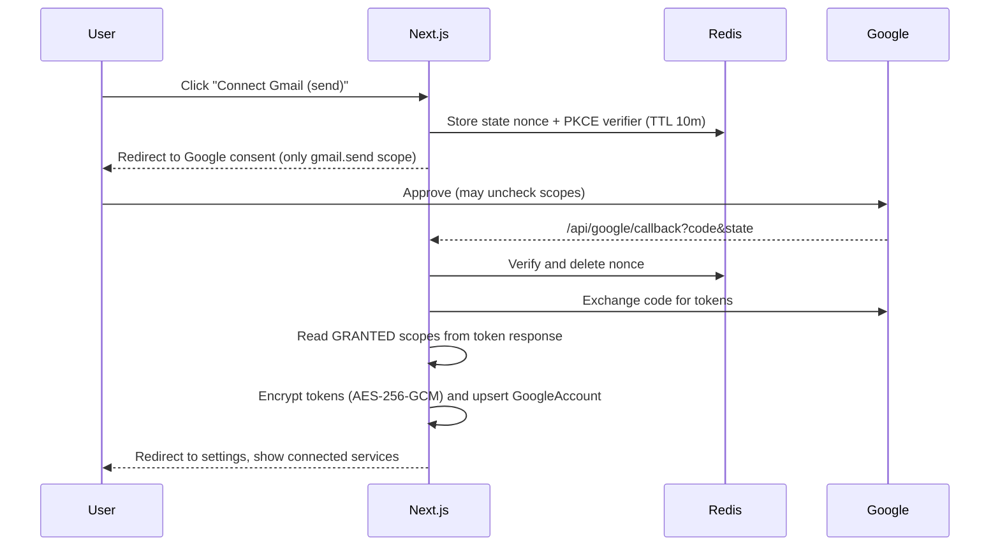

### 9.3 Scope plan (minimum viable, per feature)

| Feature | Scope | Sensitivity | Notes |
|---|---|---|---|
| Login | `openid email profile` | Basic | Always |
| Send cold email | `https://www.googleapis.com/auth/gmail.send` | Sensitive | Send-only; cannot read mailbox |
| Inbox + reply/bounce detection | `https://www.googleapis.com/auth/gmail.readonly` | **Restricted** | Required to read message content. `gmail.metadata` can't use search `q` and has no body |
| Create/edit app-created sheets, user-picked sheets | `https://www.googleapis.com/auth/drive.file` | Non-sensitive/recommended | Access limited to files the app created or the user selects via **Google Picker** — avoids the broad `spreadsheets` scope |

**Graceful degradation:** If only `gmail.send` is granted, campaigns work but automatic reply/bounce detection is disabled (UI states this). If only `drive.file` is granted, sheets work without Gmail.

> ⚠ VERIFY (important for a personal tool):
> - While the OAuth consent screen is in **"Testing"** status, refresh tokens may expire after ~7 days, and test users are capped. For personal long-term use, move to "In production" (you will see the "unverified app" screen) or complete verification.
> - **Restricted scopes (`gmail.readonly`) for a *public* multi-user product** require Google verification and possibly a third-party security assessment. For a single-user/personal deployment this is a non-issue; for a public SaaS, plan for it.

### 9.4 Token handling

- `token-store.ts` exposes `getGoogleClient(userId, service)` → returns an authorized client; **refreshes** when `accessTokenExpiresAt` is within 2 min; uses a Redis lock (`lock:gtoken:{userId}`) so concurrent jobs don't double-refresh.
- On `invalid_grant`: set `GoogleAccount.status = NEEDS_REAUTH`, **auto-pause running campaigns**, surface a banner.
- Encryption: AES-256-GCM, 32-byte key from `TOKEN_ENCRYPTION_KEY`, payload `v{keyVersion}.iv.tag.cipher`; supports key rotation by `keyVersion`.
- Tokens never leave the server; no token appears in any API response, log, or error.

---

## 10. Gmail Architecture

### 10.1 `integrations/google/gmail.ts` surface

| Function | Used by | Notes |
|---|---|---|
| `sendMessage({to, subject, html, text, headers, rfcMessageId})` | send.service | Builds RFC 2822 MIME; **sets our own `Message-ID`**, `List-Unsubscribe` + `List-Unsubscribe-Post`, `Reply-To` (optional); multipart text+HTML |
| `findSentByRfcMessageId(id)` | crash reconciliation | `rfc822msgid:` search in Sent |
| `listMessages(query, pageToken)` | inbox initial sync | ids only (cheap) |
| `getHistory(startHistoryId)` | inbox incremental sync | **primary sync mechanism** |
| `batchGetMetadata(ids)` | inbox | headers + snippet only |
| `getMessageBody(id)` | inbox (candidates only) | plain text part preferred |
| `getThreadReplies(threadId)` | reply detection | only for sent campaign threads, batched/low frequency |

### 10.2 Sending rules (cannot be disabled in config)

| Rule | Value |
|---|---|
| Hard ceiling/day | `HARD_DAILY_CAP` (default **100** for consumer Gmail; user may lower; raising requires editing env — deliberate friction). ⚠ VERIFY Gmail's current sending limits for your account type |
| Warm-up ramp | New account/campaign ramps (e.g., 10 → 20 → 40 → 80 → target over days) |
| Send window | Only within user's local window (default 09:00–17:00) |
| Pacing | Randomized spacing between sends (e.g., 45–150 s), single-flight per user |
| Retry | Retryable (429, 5xx, network): exponential backoff, max 3. Non-retryable (invalid recipient, 4xx auth): fail immediately, no retry |
| Bounce handling | Detect `mailer-daemon`/DSN replies in Inbox sync → recipient `BOUNCED` + `SuppressionEntry(BOUNCED)` |
| Content | Plain, honest subject; accurate From = authenticated account; unsubscribe link + postal address in footer; no deceptive subjects; no link shorteners; no tracking pixels |
| Circuit breaker | If bounce rate or failure rate exceeds threshold (e.g., >5% over last 20 sends) → **auto-pause** campaign and notify |

### 10.3 Message identity & idempotency

1. Before sending, generate `rfcMessageId = <uuid@senderdomain>` and persist it with `attemptId` on `CampaignLead`.
2. Send via Gmail API with that `Message-ID`.
3. If the process crashes after Gmail accepted but before the DB write, the **reconcile job** finds recipients stuck in `SENDING` > 10 min, calls `findSentByRfcMessageId` — if found → mark `SENT`; if not found → safe to requeue.

This eliminates the classic "sent but not recorded → duplicate email" failure.

---

## 11. Google Sheets Architecture

### 11.1 Roles

- **MongoDB is the source of truth.** The Sheet is a **mirror + input surface**.
- Sheet is read (a) at import and (b) once at campaign start and before each daily batch (to honor manual edits like a user typing `UNSUBSCRIBED`).
- Sheet is written via an **outbox** (batched).

### 11.2 Sheet layout

| Col | Header | Notes |
|---|---|---|
| A | `LeadID` | Hidden stable ID (survives sorting/filtering — never trust row numbers) |
| B | Business | |
| C | Category | |
| D | Website | |
| E | Email | |
| F | Phone | |
| G | Location | |
| H | Source | |
| I | Email Status | Default `NOT_SENT`; data-validation dropdown of allowed statuses |
| J | Last Contacted | ISO date |
| K | Campaign ID | optional |
| L | Message ID | optional |

`SheetLink.columnMap` allows user-owned sheets with different headers/orders (mapped in a UI step).

### 11.3 Status semantics

`NOT_SENT → QUEUED → SENDING → SENT | FAILED`; `SENT → REPLIED`; any → `UNSUBSCRIBED`/`BOUNCED`.
**A row in `SENT`, `REPLIED`, `UNSUBSCRIBED` or `BOUNCED` is never sent to** (unless explicit follow-up campaign, and never `UNSUBSCRIBED`/`BOUNCED`).

### 11.4 Write-behind outbox (cost + quota optimization)

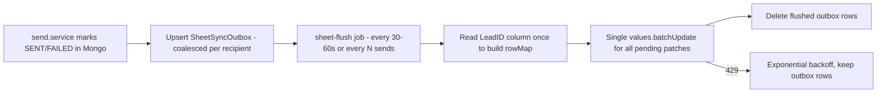

- Sending is **never blocked** by Sheets availability; the outbox guarantees eventual consistency.
- Row lookup uses the `LeadID` column read once per flush (one `values.get`), not per row.
- Respect Sheets write quotas via a Redis token bucket (`rl:sheets:{userId}`).
- Sheet *reads* for suppression are cached 60s in Redis.

---

## 12. Lead Generation Architecture

### 12.1 Provider abstraction

```ts
// server/modules/leads/providers/provider.interface.ts  (contract only)
interface LeadSourceProvider {
  key: string;                         // "places" | "osm" | "directory" | "search" | "csv"
  capabilities: { radius: boolean; ratings: boolean; website: boolean; phone: boolean; email: boolean };
  cachePolicy: { maxCacheDays: number | null; storableFields: string[] }; // ToS-driven (see 12.5)
  estimateCost(params: SearchParams): CostEstimate;                      // for preview/budget
  search(params: SearchParams, ctx: { signal: AbortSignal }): AsyncIterable<RawBusiness>; // paginated
  normalize(raw: RawBusiness): NormalizedLead;                           // -> common Lead shape
}
```

```text
LeadSourceProvider
 ├── PlacesProvider      (Google Places API New - official, field-masked)
 ├── OsmProvider         (OpenStreetMap / Overpass - open data, attribution required)
 ├── DirectoryProvider   (licensed/open business directories & public datasets)
 ├── SearchProvider      (official search APIs, e.g., Programmable Search / Bing-style APIs)
 └── CsvProvider         (user-imported CSV/Excel/URL list)
```

`registry.ts` maps `key → provider`; adding a provider = one new file + registry line + Zod params extension.

### 12.2 Pipeline

```text
Validate params (Zod) ─▶ Budget/rate guard ─▶ Cache lookup (LeadSearch.paramsHash)
 ─▶ Provider.search (paginate until maxResults or budget)
 ─▶ Normalize ─▶ Filter (hasWebsite/noWebsite/rating/phone…)
 ─▶ Dedupe ─▶ Validate ─▶ [Optional enrichment] ─▶ Upsert Mongo ─▶ Return
```

### 12.3 Normalization & dedupe

| Field | Rule |
|---|---|
| `websiteDomain` | lowercase, strip `www.`/scheme/path/tracking params |
| `emailNormalized` | trim + lowercase (Gmail dot/plus tricks are **not** collapsed for non-Gmail) |
| `phoneE164` | `libphonenumber-js` with country context |
| `dedupeKey` | first available of: `domain:` → `email:` → `phone:` → `hash(name+postal)` |
| In-batch dedupe | by `dedupeKey` before DB |
| DB dedupe | unique `(userId, dedupeKey)`; upsert, **never overwrite user-edited fields** (`updatedByUser` guard via notes/status) |

### 12.4 Optional enrichment (opt-in, cost-aware)

| Enrichment | Method | Cost control |
|---|---|---|
| Public email discovery | `site-fetcher`: homepage + `/contact`, `mailto:` + visible addresses; prefers role addresses; records `emailSource` | robots-aware, 1 req/s/domain, 5s timeout, max 3 pages, cached on Lead |
| Website "outdated" signals | Heuristics only: no HTTPS, no viewport meta, old generator tag, copyright year, no mobile nav | Zero AI cost |
| AI summary (optional) | 1–2 line "what they do" from title/meta/first 500 chars | Batched, cached, budget-capped |
| MX check | DNS `resolveMx` | Free |

> Only addresses that are **publicly published for business contact** are collected; each is stored with its source for auditability.

### 12.5 Source terms & storage policy (**⚠ VERIFY before building the Places provider**)

Google Maps Platform terms have restrictions on caching/storing/exporting Places content (generally `place_id` is storable; most other fields have limited caching). A tool that stores Places results long-term and syncs them to Sheets may conflict with those terms. The architecture therefore:

- Gives each provider a `cachePolicy` and writes `Lead.retentionExpiresAt` accordingly; a maintenance job purges/refreshes expired fields (keeping `externalId` such as `place_id`).
- Defaults MVP provider order to **open/permissive sources** (OSM/Overpass, public datasets, user CSV, directories with API terms that allow storage), with **Places as an opt-in provider** only after you confirm terms/pricing for your use.
- Never automates the Google Maps/Search *web UI*.

### 12.6 Lead Generator UI contract

Form: category (preset + custom), niche, country → state → city → postal, radius (km/mi toggle), filters, `maxResults` (default 50, capped), provider select, enrichment toggles, **"Estimate cost/results" (free)** → **"Search"**. Results table: select, edit inline, delete, export CSV/Excel, **Create Google Sheet**, **Sync selected**.

---

## 13. Cold Email Architecture

### 13.1 Campaign lifecycle

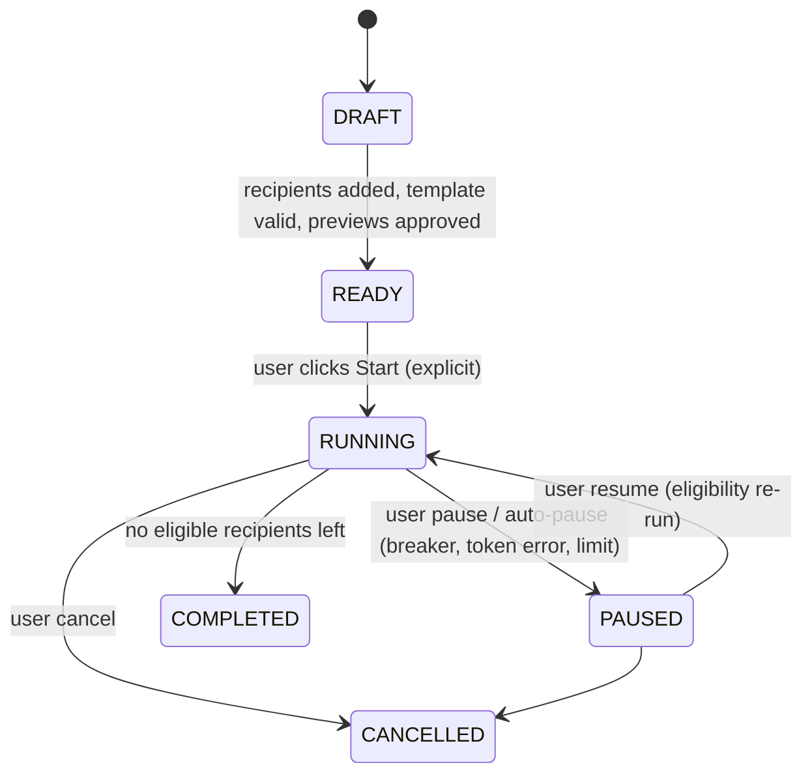

### 13.2 Template system

- Merge fields: `{{businessName}} {{category}} {{location}} {{website}} {{ownerName?}} {{personalizedOpening}} {{personalizedObservation}} {{senderName}} {{userEmail}} {{portfolioUrl}} {{unsubscribeUrl}}`.
- `{{userEmail}}` resolves from the **authenticated Google account** (`GoogleAccount.email`) — never hard-coded. Portfolio URL and signature come from user settings (defaults can be seeded with `https://narenroy.in/` at onboarding, editable).
- **Validation on save/start:** no unknown fields; no unresolved fields for any recipient (missing optional fields fall back to defined defaults or block with a clear message); required footer fields exist.
- Rendering is deterministic (`template.service.ts`), HTML-escaped, plain-text alternative auto-generated.
- Footer (auto-appended, non-removable): sender identity, postal address, unsubscribe link.

Default template (user-editable):

```text
Hi {{businessName}},

I came across {{businessName}} while looking at {{category}} businesses in {{location}}.

{{personalizedObservation}}

I build modern websites and interactive digital experiences for businesses that want a stronger online presence.

If you're considering creating or improving your website, feel free to reach out at {{userEmail}}.

Portfolio: {{portfolioUrl}}

Best,
{{senderName}}
Full Stack Software Developer
```

### 13.3 The guarded send pipeline (`send.service.processOne`)

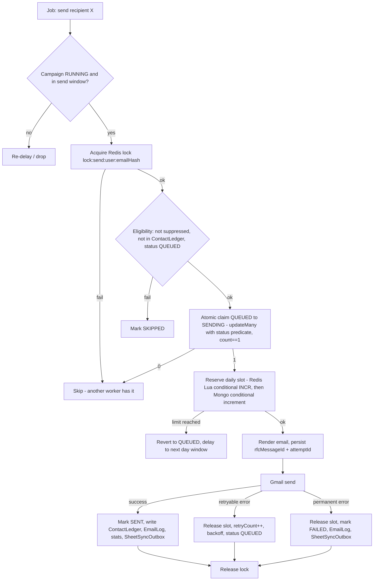

### 13.4 Duplicate prevention — four layers

| # | Layer | Stops |
|---|---|---|
| 1 | `@@unique([campaignId, emailNormalized])` | Same lead twice in a campaign (the "same lead appears twice → one email" test) |
| 2 | `ContactLedger @@unique([userId, emailNormalized])` | Same address across campaigns |
| 3 | Atomic status claim `QUEUED → SENDING` | Concurrent workers / double-clicks / retries |
| 4 | Redis lock + Gmail `Message-ID` reconciliation | Races and crash-after-send |

Plus Sheet-status check at start and before each daily batch.

### 13.5 Daily limit enforcement

- **Durable truth:** `DailySendCounter(userId, date_in_user_tz)`; reserve slot with `updateMany({where:{userId,date,count:{lt:limit}}, data:{count:{increment:1}}})` → `count===0` ⇒ limit hit (atomic, works across tabs/workers).
- **Fast path:** Redis Lua script (`GET/INCR` with cap) to avoid Mongo writes on rejected attempts; Mongo reconciles.
- **Effective limit** = `min(campaign.dailyLimit, user.defaultDailyLimit, HARD_DAILY_CAP, warmupRamp(day))`.
- Frontend input is advisory only; `PATCH`/`start` re-validate server-side, and the worker re-checks per email.
- Release on failure (decrement) so only successful sends consume quota.

### 13.6 Dispatcher design (cost-efficient)

Do **not** enqueue thousands of delayed jobs. One repeatable **dispatcher** job per running campaign:

1. Wake every ~30–60 s (or schedule next wake = next allowed send time).
2. If within window and quota remains and pacing allows → pull **1 recipient** (`QUEUED/NOT_SENT`, ordered by `createdAt`) and enqueue `send-email` job with jitter.
3. Stop when quota exhausted → reschedule for next day window start.

Result: bounded queue size, trivial pause/resume (just stop the dispatcher), minimal Redis commands.

### 13.7 Reply, bounce, unsubscribe handling

| Event | Detection | Effect |
|---|---|---|
| Unsubscribe | Public tokenized endpoint / `List-Unsubscribe` one-click | `SuppressionEntry`, recipient `UNSUBSCRIBED`, sheet patch, pending sends cancelled |
| Bounce | DSN message in Inbox sync (requires `gmail.readonly`) | `BOUNCED` + suppression |
| Reply | Inbox sync sees reply in tracked thread from recipient | `REPLIED`, stop follow-ups, optionally create `isOpportunity` item |

If `gmail.readonly` isn't granted, these are manual (user marks replied) and the UI says so.

---

## 14. Inbox Architecture

### 14.1 Sync strategy (cheap, incremental)

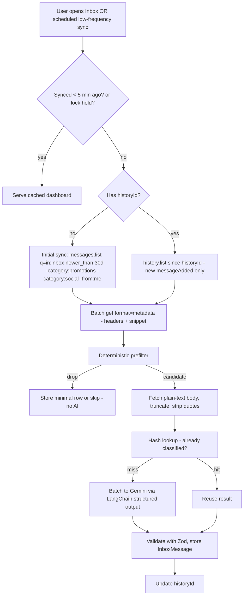

If `history.list` returns "start history id too old/not found" → fall back to a bounded initial sync.

### 14.2 Deterministic pre-filter (runs **before** any AI)

Skip AI when any is true: sender is the user; `Auto-Submitted` / `Precedence: bulk` headers; `List-Unsubscribe` present with Gmail category promotions/updates; `noreply@`/`no-reply@`/`notifications@` patterns; known SaaS/notification domains (user-editable allowlist/denylist); calendar invites; DSN bounce (route to bounce handler instead); already in `InboxMessage` with `contentHash`.

Optionally **boost** (not decide) with keyword hints (`website`, `redesign`, `developer`, `quote`, `proposal`, `build an app`) to prioritize AI order within budget.

### 14.3 What is stored

Metadata + ≤300-char snippet + classification result. **No full body**. "Open in Gmail" link built as `https://mail.google.com/mail/u/{accountEmail}/#all/{threadId}`; body is fetched live from Gmail on demand if the drawer needs it.

### 14.4 Dashboard

Columns: Sender, Email, Subject, Date, Preview, Category badge, Opportunity status, Confidence, "Open in Gmail". Filters: opportunities only (default), category, status, date. Actions: mark reviewed/dismissed, **override category** (stored; used later as few-shot examples). **No send/reply buttons** — only "Open in Gmail".

### 14.5 Untrusted-content safety

Email text is **untrusted input** to the LLM: the classifier has **no tools**, output is schema-constrained, content is wrapped in delimiters with an instruction that its content is data not instructions, and results are validated (unknown category ⇒ `GENERAL`, confidence clamped 0–1). Prompt-injection can at worst mislabel a message.

---

## 15. AI Architecture

### 15.1 Structure

```text
server/integrations/ai/
  gemini.ts              model factory: getModel("classify" | "personalize" | "escalate") from config
  usage.ts               record tokens, enforce monthly budget (throws BUDGET_EXCEEDED)
  cache.ts               content-hash cache (Redis short TTL; permanent copy on InboxMessage/CampaignLead)
  prompts/
    emailClassification.ts   versioned (PROMPT_VERSION), few-shot, category definitions
    leadPersonalization.ts   versioned, strict length limits, forbids invented facts
    emailGeneration.ts       optional full-draft; disabled by default (cost)
  chains/
    emailClassifier.ts       classifyBatch(emails[]) -> Result[]
    emailPersonalizer.ts     personalizeBatch(leads[]) -> Fields[]
```

### 15.2 Classification contract (Zod / JSON schema)

```json
{
  "id": "gmailMessageId",
  "category": "WEBSITE_INQUIRY",
  "isOpportunity": true,
  "confidence": 0.94,
  "reason": "The sender explicitly requested website development."
}
```

- Categories: `WEBSITE_INQUIRY, SOFTWARE_INQUIRY, FREELANCE_OPPORTUNITY, JOB_OPPORTUNITY, PARTNERSHIP, GENERAL, NOT_RELEVANT`.
- `isOpportunity` is **derived server-side** from category (+ confidence threshold) so the model can't contradict the schema; the model's value is stored only as a hint.
- Invalid/partial output → retry once with the failed items only; then mark `GENERAL` with `confidence=0` and flag for manual review.
- Prompt + model version stored on each row (`promptVersion`, `modelUsed`) for later re-evaluation.

### 15.3 Personalization contract

Input per lead: `businessName, category, city, websiteTitle, metaDescription, snippet(≤500 chars)`.
Output: `{ personalizedOpening: string(≤160 chars), personalizedObservation: string(≤240 chars) }`.
Rules in prompt: use **only provided facts**; no flattery claims, no invented metrics, no claims of having "reviewed the site in detail"; if insufficient info → return empty strings (template falls back to default text). Output is shown in **preview** and requires user approval before start.

### 15.4 LangChain usage policy

Use only: Gemini chat model wrapper, `withStructuredOutput(zodSchema)`, `RunnableSequence`/batch helpers. **Avoid** agents, memory, retrieval chains for the MVP (bundle weight, latency, cost). LangChain code lives **only** in `server/integrations/ai` and is never imported into client bundles.

### 15.5 Reliability

Timeouts (e.g., 20s), retry with backoff on 429/5xx, per-user concurrency cap (Redis semaphore), circuit breaker on repeated failures → AI features degrade to rules-only.

---

## 16. Redis Architecture

Redis is **ephemeral coordination**, never the source of truth.

### 16.1 Uses & key design

| Purpose | Key pattern | TTL | Notes |
|---|---|---|---|
| API rate limiting | `rl:{policy}:{userIdOrIp}` | window | Sliding window / token bucket |
| Send lock | `lock:send:{userId}:{emailHash}` | 120 s | `SET NX PX` + token-checked release |
| Sync lock | `lock:inbox:{userId}` | 5 min | |
| Token refresh lock | `lock:gtoken:{userId}` | 30 s | |
| Daily counter (fast path) | `cnt:{userId}:{yyyy-mm-dd}` | 48 h | Lua conditional INCR; Mongo reconciles |
| Pacing | `pace:{userId}` | seconds | Next allowed send timestamp |
| OAuth state | `oauth:state:{nonce}` | 10 min | One-time |
| AI cache | `ai:{task}:{hash}` | 1–7 d | |
| Sheet status cache | `sheet:status:{sheetLinkId}` | 60 s | |
| Inbox sync state | `inbox:last:{userId}` | 5 min | Debounce |
| BullMQ internals | `bull:*` | managed | |

### 16.2 Rules

- Always set TTLs; namespaced prefix `app:{env}:`.
- Atomicity via **Lua scripts** (reserve slot, release-if-owner).
- Redis restart must be **safe**: counters rebuild from `DailySendCounter`; locks expire; queue state recoverable from `CampaignLead.status` (maintenance job re-seeds dispatcher). Use AOF persistence on the worker's Redis for fewer surprises.
- **Cost:** use standard Redis with flat pricing for BullMQ (it issues steady background commands; per-command pricing models can become costly). Keep `maxmemory-policy noeviction` for queue Redis (or separate cache instance if needed).

---

## 17. Queue Architecture

### 17.1 Decision: BullMQ vs alternatives

| Option | Pros | Cons | Verdict |
|---|---|---|---|
| **BullMQ + Redis + small worker** | Mature, repeatable jobs, rate limiting, delayed jobs, concurrency control, retries, observability (Bull Board) | Needs persistent TCP connection ⇒ **cannot run in serverless functions**; one more process to host | ✅ **Recommended** — fits "email sending must not depend on the browser" and strict pacing |
| Upstash QStash / Inngest / Trigger.dev (serverless queues) | No worker to host; HTTP-callback jobs | Per-message pricing/limits; more vendor lock-in; weaker fine-grained pacing/locking | Good fallback if you refuse to run a worker |
| Mongo-backed jobs + external cron tick | No Redis queue needed | You re-implement locking/retries; cron granularity limits | Possible ultra-minimal MVP, not recommended |
| Vercel Cron only | Zero infra | Coarse schedule, function time limits, not suited for paced sending | ❌ for sending; ✅ for triggering maintenance only |

Implement behind `QueueDriver` (`add`, `schedule`, `pause`, `resume`, `getCounts`) so swapping later is localized.

### 17.2 Queues

| Queue | Concurrency | Jobs |
|---|---|---|
| `email` | **1 per user** (use job `group`/keyed lock; global concurrency 2–3 for single-user) | `dispatch-campaign` (repeatable), `send-email`, `reconcile-stuck-sending` |
| `sheets` | 1 | `flush-sheet-outbox` (repeatable ~45s while outbox non-empty) |
| `inbox` | 2 | `inbox-sync`, `classify-batch` |
| `maintenance` | 1 | daily counter rollup, TTL/retention purge, AI usage rollup, token health check |

### 17.3 Job policy

- `attempts: 3`, exponential backoff, `removeOnComplete: {age: 1d, count: 1000}`, `removeOnFail: {age: 7d}` (bounded Redis memory).
- Jobs carry **IDs only** (campaignLeadId), never PII/payloads; processors reload fresh state from Mongo.
- Every processor is **idempotent** (re-running is harmless because of the claim/lock/ledger design).
- Graceful shutdown: stop pulling jobs, finish current send, release locks.
- Worker emits structured logs with `jobId`, `campaignId`, `userId` (hashed email only).

---

## 18. Pinecone / Vector Architecture

**Optional; disabled by default (`FEATURE_VECTOR=false`).**

```ts
interface VectorStore {
  upsert(namespace: string, items: { id: string; text: string; metadata: Record<string,string|number> }[]): Promise<void>;
  query(namespace: string, text: string, topK: number, filter?: object): Promise<Match[]>;
  delete(namespace: string, ids: string[]): Promise<void>;
}
// PineconeProvider implements VectorStore. A NoopVectorStore is the default binding.
```

| Future use | Namespace | Notes |
|---|---|---|
| Similar-business discovery | `leads:{userId}` | Embed `category + niche + description` |
| Semantic lead search | `leads:{userId}` | |
| Similar past opportunities / personalization context | `inbox:{userId}` | Embed snippets only |
| Campaign analytics clustering | `campaigns:{userId}` | |

Cost rules: embed only on explicit user action or nightly batch; batch upserts; never embed email bodies; small embedding dimension; delete vectors when source rows are deleted; per-user namespaces.

---

## 19. Security

### 19.1 Secrets & configuration

| Secret | Location | Exposure rule |
|---|---|---|
| `DATABASE_URL`, `REDIS_URL`, `GEMINI_API_KEY`, `PINECONE_API_KEY`, `GOOGLE_CLIENT_SECRET`, `AUTH_SECRET`, `TOKEN_ENCRYPTION_KEY`, `UNSUBSCRIBE_SIGNING_KEY`, `CRON_SECRET` | Server env only (host secret manager) | **Never** `NEXT_PUBLIC_*`; `config/env.ts` (Zod) fails fast on missing/invalid; `server-only` import guards; secret-scanning in CI |
| Public config | `NEXT_PUBLIC_APP_URL` only | Non-sensitive |

### 19.2 Controls matrix

| Area | Control |
|---|---|
| OAuth tokens | AES-256-GCM at rest, key rotation via `keyVersion`, minimal scopes, revoke on disconnect, never logged |
| Sessions | Auth.js JWT in `HttpOnly`, `Secure`, `SameSite=Lax` cookie; short TTL + rotation |
| CSRF | Auth.js CSRF for auth routes; for JSON APIs: same-origin `Origin`/`Host` check on mutating routes + `SameSite` cookies + no GET mutations |
| XSS | React escaping; never `dangerouslySetInnerHTML` with email/lead content; render email previews in a **sandboxed iframe** (`sandbox`, no scripts) or sanitized with DOMPurify; strict CSP (nonce-based), `X-Content-Type-Options`, `Referrer-Policy`, `frame-ancestors 'none'` |
| Injection | Prisma parameterized queries; Zod `strict()` schemas; reject unknown keys; no raw Mongo operators from clients |
| SSRF (site fetcher) | Block private/loopback/link-local IP ranges after DNS resolve, only `http(s)`, size/time limits, no redirects to private hosts |
| Authorization | `userId` from session on every query; ownership check helpers; tests for IDOR on every `[id]` route |
| File uploads | Size + MIME + row limits; parse in worker/memory-safe stream; never execute |
| Rate limiting | §8.7; separate limits for expensive/paid operations |
| Email abuse prevention | Hard daily cap, warm-up, window, pacing, breaker, suppression, explicit start, audit log, no direct send endpoint |
| Dependency security | `npm audit`/Dependabot, lockfile, minimal deps |
| Logging | Redact tokens, emails (hash/mask), bodies; never log request bodies for auth/Google routes |
| Data privacy | Minimal inbox storage; retention TTLs; "Delete my data" in Settings (purges leads, campaigns, inbox, revokes Google) |
| Infra | MongoDB Atlas IP allowlist/VPC peering where available, least-privilege DB user, TLS to Redis, separate dev/prod projects & OAuth clients |

### 19.3 Error exposure

`toResponse(error)` maps `AppError` → safe `{code, message}`; unknown errors → generic `INTERNAL` with `requestId`. Stack traces only in server logs.

---

## 20. Compliance Safeguards

> This is engineering guidance, not legal advice. Cold-email rules differ by recipient country (e.g., US CAN-SPAM, UK PECR/UK GDPR, EU ePrivacy/GDPR, Canada CASL, Australia Spam Act). B2B rules vary — **verify obligations for the countries you target**, especially the EU/UK/Canada.

| Safeguard | Implementation |
|---|---|
| Explicit user control | Campaign never starts without `confirm:true`; no scheduled auto-start |
| Unsubscribe | Link in every email + `List-Unsubscribe` / one-click header; processed immediately; public endpoint; works without login |
| Suppression list | `SuppressionEntry` (address/domain); checked at import, at start, **and again at send time** |
| Do-not-contact | `Lead.status=DO_NOT_CONTACT` + suppression sync |
| Duplicate detection | §13.4 |
| Sending limits | §13.5, hard cap not removable from UI |
| Clear/accurate sender identity | From = authenticated Gmail; sender name/signature required; postal address required before first start |
| Accurate content | Honest subject lines; template validator blocks empty/deceptive patterns (e.g., fake "Re:" prefixes) |
| Legitimate addresses only | `emailSource` provenance stored; discovery only from publicly published business contact info; role/business addresses preferred; personal-looking addresses flagged for manual confirmation |
| Campaign pause + auto-pause | Manual + circuit breaker |
| Logs | `EmailLog`, `AuditLog` (start/pause/disconnect/export) |
| No spam-filter evasion | No spintax abuse, no header spoofing, no rotating accounts, no limit circumvention |
| Data rights | Per-lead deletion, global "purge my data", suppression entries retained only as hashes where deletion is required |

---

## 21. Environment Variables

`.env.example` (placeholders only — never commit real values):

```env
# ── App ─────────────────────────────────────────────
NODE_ENV=development
NEXT_PUBLIC_APP_URL=http://localhost:3000
APP_ENV=development                      # development | staging | production
LOG_LEVEL=info

# ── Auth.js ─────────────────────────────────────────
AUTH_SECRET=                             # openssl rand -base64 32
AUTH_TRUST_HOST=true

# ── Google OAuth (one client; separate clients per environment) ──
GOOGLE_CLIENT_ID=
GOOGLE_CLIENT_SECRET=
GOOGLE_OAUTH_REDIRECT_URI=http://localhost:3000/api/google/callback
GOOGLE_PICKER_API_KEY=                   # browser-restricted key for Picker (public-safe, referrer-restricted)

# ── Encryption / signing (generate 32 random bytes, base64) ──
TOKEN_ENCRYPTION_KEY=
TOKEN_ENCRYPTION_KEY_VERSION=1
UNSUBSCRIBE_SIGNING_KEY=
CRON_SECRET=

# ── Database ────────────────────────────────────────
DATABASE_URL=                            # mongodb+srv://... (replica set)

# ── Redis / Queue ───────────────────────────────────
REDIS_URL=                               # rediss://... for TLS
REDIS_KEY_PREFIX=app:dev:
QUEUE_DRIVER=bullmq                      # bullmq | noop (tests)

# ── AI ──────────────────────────────────────────────
GEMINI_API_KEY=
AI_MODEL_CLASSIFY=                       # cheapest capable model id (set at deploy time)
AI_MODEL_PERSONALIZE=
AI_MODEL_ESCALATE=
AI_MONTHLY_TOKEN_CAP=1000000
AI_BATCH_SIZE=15
AI_MAX_INPUT_CHARS=1500
FEATURE_AI_PERSONALIZATION=true
FEATURE_AI_CLASSIFICATION=true

# ── Lead sources ────────────────────────────────────
GOOGLE_PLACES_API_KEY=                   # server-only; optional provider
PLACES_DAILY_REQUEST_BUDGET=200
OSM_OVERPASS_URL=
SEARCH_API_KEY=                          # optional search provider
LEADS_MAX_RESULTS_PER_SEARCH=100
SITE_FETCH_USER_AGENT=OutreachDashboard/1.0 (+contact-url)

# ── Vector (optional) ───────────────────────────────
FEATURE_VECTOR=false
PINECONE_API_KEY=
PINECONE_INDEX=
PINECONE_NAMESPACE_PREFIX=

# ── Sending safety ──────────────────────────────────
HARD_DAILY_CAP=100
DEFAULT_DAILY_LIMIT=25
WARMUP_ENABLED=true
SEND_MIN_DELAY_SEC=45
SEND_MAX_DELAY_SEC=150
BREAKER_FAILURE_THRESHOLD=0.05
INBOX_MIN_SYNC_INTERVAL_SEC=300
INBOX_RETENTION_DAYS=90

# ── Monitoring (optional) ───────────────────────────
SENTRY_DSN=
```

`config/env.ts` validates all with Zod at boot (server and worker) and exposes a typed `env` object.

---

## 22. Data Flow Diagrams

### 22.1 Lead generation

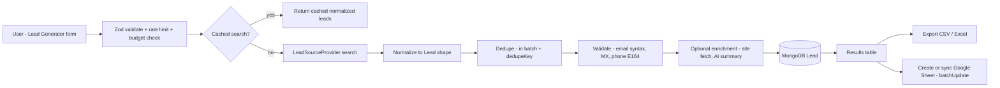

### 22.2 Cold email

```mermaid
flowchart LR
  SRC["Google Sheet / CSV / Leads"] --> IMP["Import to CampaignLead snapshot"]
  IMP --> CAMP["Campaign RUNNING after explicit Start"]
  CAMP --> DISP["Dispatcher job"]
  DISP --> Q["BullMQ send-email"]
  Q --> RL["Lock + daily counter + pacing"]
  RL --> GM["Gmail API send"]
  GM --> LOG[("EmailLog + CampaignLead + ContactLedger")]
  LOG --> OB[("SheetSyncOutbox")]
  OB --> FL["Sheet flush job - batch"]
  FL --> GS["Google Sheet status update"]
```

### 22.3 Inbox

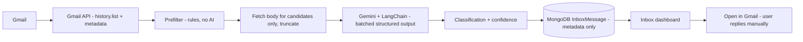

### 22.4 Reply / bounce / unsubscribe feedback loop

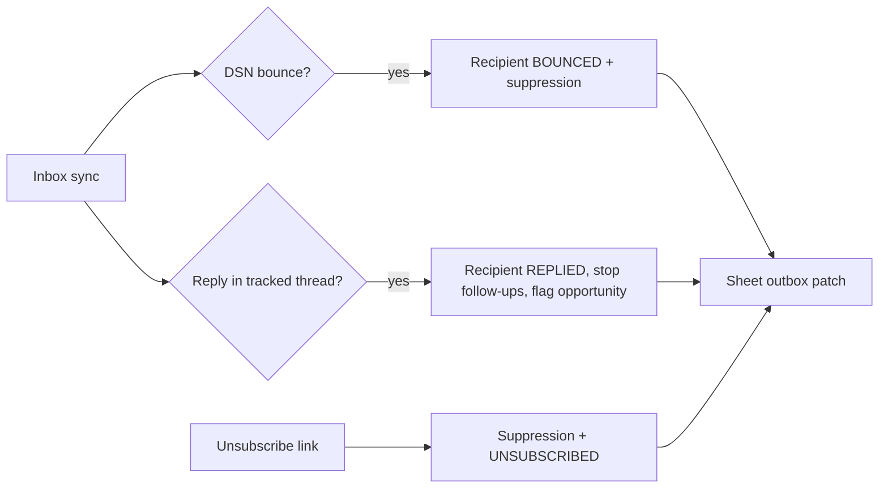

---

## 23. Cross-Cutting Concerns

### 23.1 State management

| State type | Tool | Used for |
|---|---|---|
| Server data, mostly read | **Server Components** + service calls | Overview, analytics, initial table pages (zero client JS for data) |
| Interactive server data | **TanStack Query** (`staleTime` 30–60s, `refetchOnWindowFocus`, conditional `refetchInterval` only while a campaign is RUNNING) | Lead table filtering, campaign progress, inbox list |
| Filters/sort/pagination | **URL search params** | Shareable, back-button friendly, server-render-able |
| Ephemeral UI | **React state** (`useState/useReducer`) | Modals, wizard step, selection |
| Complex multi-step form | React Hook Form (+ `sessionStorage`-free; state in memory) | Campaign wizard |
| Tiny settings mutations | **Server Actions** | Theme, profile fields |
| Global client store | **Avoid** (add Zustand only if truly needed) | — |

### 23.2 Validation

Zod everywhere; schemas in `validators/` shared by forms and handlers; **server re-validates always**. Validate: leads, imports (row-level with error report), campaign/template (merge-field validator), API params, OAuth callback (`state`, `code`, granted scopes), settings, env.

### 23.3 Error handling

`AppError(code, httpStatus, safeMessage, { retryable, cause })` with taxonomy:

| Source | Mapped codes (examples) | User message style |
|---|---|---|
| Validation | `VALIDATION` | Field-level messages |
| Auth | `UNAUTHENTICATED`, `FORBIDDEN`, `OAUTH_*`, `GOOGLE_NEEDS_REAUTH` | "Reconnect your Google account" |
| Gmail | `GMAIL_RATE_LIMIT`, `GMAIL_INVALID_RECIPIENT`, `GMAIL_AUTH` | Retryable flag drives queue behavior |
| Sheets | `SHEETS_QUOTA`, `SHEETS_NOT_FOUND`, `SHEETS_PERMISSION` | "Sheet changes will sync shortly" for quota |
| Gemini | `AI_RATE_LIMIT`, `AI_INVALID_OUTPUT`, `BUDGET_EXCEEDED` | Degrade gracefully |
| Redis | `REDIS_UNAVAILABLE` | Sending **fails closed** (no Redis ⇒ no sends); reads continue |
| MongoDB | `DB_UNAVAILABLE`, `DUPLICATE_KEY` | Duplicate → idempotent success where appropriate |
| Queue | `QUEUE_ERROR` | "Couldn't start; nothing was sent" |
| Rate limit | `RATE_LIMITED` (+ `Retry-After`) | Shows when to retry |

**Fail-closed principle:** any uncertainty in limit/dup/suppression checks ⇒ **do not send**.

### 23.4 Logging & monitoring

- `pino` JSON logs; `requestId` generated per request (propagated to jobs via job metadata → `jobId` + `requestId`).
- Event taxonomy: `email.send.{attempt,success,failure,skipped}`, `oauth.{start,callback,refresh_failed}`, `inbox.sync.{start,done,failed}`, `lead.import`, `lead.search`, `ai.call.{ok,invalid,budget}`, `queue.job.{failed,stalled}`, `sheet.flush`.
- Fields: `userId` (internal id), `campaignId`, `jobId`, durations, counts. **No** tokens/bodies/raw emails (mask `a***@d***.com`).
- Monitoring: Sentry (errors), Bull Board (protected, behind auth) for queues, `/api/health`, uptime ping, alert on: worker down, queue age > threshold, breaker tripped, token `NEEDS_REAUTH`, AI budget 80%.

### 23.5 Analytics

Computed from MongoDB aggregates + `Campaign.stats` denormalized counters + nightly rollups (cached 60s):

Total leads · leads contacted · emails sent/failed/bounced · replies · opportunities (classified) · daily sending volume · per-campaign performance (sent, reply rate, bounce rate) · simple conversion (lead → reply → opportunity → manually marked "won").
**No open/click metrics** unless a legitimate provider signal exists (Gmail API doesn't provide them; no tracking pixels).

### 23.6 Responsive design

Desktop-first. Breakpoints: tables → horizontally scrollable container (`overflow-x-auto`, sticky first column) on tablet; **card list** on mobile; sidebar collapses to drawer; wizard steps stack. Touch targets ≥ 40px.

### 23.7 UI style

Developer-focused SaaS: neutral palette with one accent, dark/light via CSS variables (`next-themes`), strong spacing scale (4px base), tabular numerals for data, monospace for IDs, clear status chips (`NOT_SENT` gray, `QUEUED` blue, `SENDING` amber, `SENT` green, `FAILED` red, `REPLIED` violet, `UNSUBSCRIBED` slate), command palette (`cmdk`) and keyboard shortcuts, skeleton loaders. Inspired by general principles of Linear/Vercel/Raycast/Resend — **not** cloned.

### 23.8 Animation direction (GSAP + Lenis)

| Where | Treatment | Notes |
|---|---|---|
| Route transitions | 150–250 ms fade/translate via `<PageTransition/>` | |
| Dashboard load | Staggered card/table reveal (once) | Skip for cached navigations |
| Sidebar / drawers / modals | Short ease-out transitions | |
| Table interactions | Row highlight, selection feedback | CSS first; GSAP only if CSS insufficient |
| Campaign progress | Smoothly tweened progress bar/number | |
| Toasts | Slide-in/out | |
| Lenis | Landing/login + long document pages; **off** inside data tables/modals (`data-lenis-prevent`) | |

Rules: `prefers-reduced-motion` disables non-essential motion; GSAP/Lenis loaded via `dynamic()`; use `gsap.context()`/`useGSAP` cleanup; animate `transform/opacity` only; no animation blocks interaction; no scroll-jacking on dashboards.

---

## 24. Development Phases

Each phase ends with a working, committed increment. Phases 1–5 deliver Module 1; 6–8 Module 2; 9–10 Module 3 — so you can **ship and use** each module independently.

| # | Phase | What gets built | Key files | Dependencies | Prerequisites | Expected result |
|---|---|---|---|---|---|---|
| 1 | **Project setup** | Next.js + TS strict, Tailwind, shadcn/ui, ESLint/Prettier, dependency-cruiser, folder skeleton, env validation, logger, error classes, route-handler wrapper, theme, dashboard shell (sidebar/topbar), GSAP/Lenis providers (lazy) | `config/env.ts`, `platform/http/*`, `platform/errors/*`, `components/layout/*`, `components/motion/*` | next, tailwind, zod, pino, next-themes, gsap, lenis | Node LTS, repo | Empty responsive dashboard with theming and animations; CI runs lint/typecheck |
| 2 | **Authentication** | Auth.js Google login (basic scopes), JWT session, middleware gate, `requireUser`, `withAuth` | `platform/auth/*`, `app/(auth)/login`, `api/auth/*` | next-auth, @auth/prisma-adapter | Google Cloud project + OAuth client; Phase 3 schema for User/Account (do 3 first or stub) | Can sign in/out; protected routes work |
| 3 | **Database** | Prisma schema (§7), Atlas cluster, `db push`, singleton client, repositories skeleton, seed script, index checks | `prisma/schema.prisma`, `platform/db/prisma.ts`, `*.repository.ts` | prisma, @prisma/client | Atlas (replica set) | All models exist; integration tests run against test DB |
| 4 | **Lead Generator** | Provider interface + registry, CSV provider, OSM provider (and optionally Places), normalize/dedupe/validate pipeline, search UI, results table (virtualized), edit/delete, CSV/Excel export, cost estimate/preview | `modules/leads/*`, `features/leads/*`, `api/leads/*` | papaparse, xlsx (lazy), libphonenumber-js, TanStack Query/Table/Virtual | Phases 1–3 | Search/import/dedupe/export fully working **without Google** |
| 5 | **Google Sheets integration** | Incremental OAuth flow, token encryption/store, Sheets client, create/sync sheet, Picker for existing sheets, column mapping, `SheetLink` | `integrations/google/{oauth,token-store,sheets,drive-picker}.ts`, `api/google/*`, `api/leads/sync-google-sheet`, settings/google page | googleapis (scoped pkgs) | Phase 2; consent screen configured | Leads → Google Sheet in one batched call; reconnect/revoke UI |
| 6 | **Campaign system** | Campaign CRUD, wizard, recipient import (CSV/Sheet/Leads → snapshot), template engine + validator, preview, suppression list, unsubscribe page/token, settings (sender identity) | `modules/campaigns/{campaign,recipient.import,template,eligibility,unsubscribe}*`, `features/campaigns/*`, `api/campaigns/*`, `api/suppression`, `api/unsubscribe/*` | zod, DOMPurify (preview) | Phases 3,5 | Fully previewable campaigns **without sending** |
| 7 | **Gmail sending** | `gmail.send` scope flow, MIME builder, `Message-ID`, `List-Unsubscribe`, `send.service.processOne` (synchronous, behind a feature flag, 1 email test mode), reconcile logic, DailySendCounter (Mongo) | `integrations/google/gmail.ts`, `modules/campaigns/{send,limits}.service.ts` | — | Phase 6 | Send a controlled test email to yourself; status persisted; limits enforced in DB |
| 8 | **Redis + background jobs** | Redis client, locks, Lua counters, BullMQ driver, dispatcher, send processor, sheet outbox + flush, pause/resume, breaker, worker Dockerfile, Bull Board | `platform/{redis,queue,ratelimit}/*`, `worker/*`, `Dockerfile.worker`, `SheetSyncOutbox` logic | ioredis, bullmq, tsup | Phase 7; Redis + worker host | Campaign runs unattended; sheet statuses update in batches; duplicate/limit tests pass |
| 9 | **Inbox integration** | `gmail.readonly` flow, incremental sync (`historyId`), metadata-first fetch, prefilter, `InboxMessage` storage, dashboard UI, bounce/reply detection feeding campaigns | `modules/inbox/*`, `features/inbox/*`, `api/inbox/*`, `worker/processors/inbox-sync` | — | Phases 5/8 | Inbox lists relevant emails without AI; sync is incremental |
| 10 | **AI classification (+ personalization)** | Gemini factory, versioned prompts, batched structured-output chains, caching, `AiUsage` + budget guard, classification in inbox pipeline, optional personalization in campaign prepare/preview | `integrations/ai/*`, `modules/inbox/*`, `campaign prepare/preview` | @langchain/google-genai, @langchain/core | Phase 9; paid-tier key (see §4.2 #10) | Opportunities flagged with confidence; AI usage page shows spend vs. cap |
| 11 | **Analytics** | Aggregations, rollup job, overview + analytics pages (lazy charts) | `modules/analytics/*`, `features/analytics/*` | recharts (lazy) | Phases 6–10 | Accurate counts; no fabricated metrics |
| 12 | **Security, testing, deployment** | CSP/headers, IDOR test sweep, e2e tests, load/limit tests, Sentry, CI/CD, backups, runbook, production OAuth config, privacy/delete-my-data | `next.config` headers, `tests/*`, deploy configs | playwright, vitest, msw, sentry | All | Production-ready, documented deployment |

**Suggested MVP cut:** Phases 1–8 (+ 12's essentials). Inbox/AI (9–10) can follow immediately because they're independent.

---

## 25. Testing Strategy

| Level | Tooling | Scope |
|---|---|---|
| Unit | Vitest | normalizers, dedupe keys, template renderer/validator, warm-up ramp, prefilter rules, crypto, error mapping, Zod schemas |
| Integration (DB) | Vitest + MongoDB **replica set** (Testcontainers / `mongodb-memory-server` replica set) | repositories, unique indexes, atomic claim, daily counter |
| Integration (Redis/queue) | Vitest + **real Redis container** (not mocks — Lua/locks need real semantics) | locks, Lua counter, BullMQ processors, dispatcher |
| API | Vitest + route-handler invocation / supertest-style | auth, validation, ownership (IDOR), error shapes, rate limits |
| External mocks | **MSW** for Gmail, Sheets, Gemini, Places, Google OAuth endpoints | success, 401, 403, 429, 5xx, malformed JSON, `invalid_grant`, history-id-expired |
| OAuth | Mock token endpoint; test state/nonce misuse, scope-denied, partial consent | |
| AI response validation | Golden dataset (~30–50 labeled emails) + schema tests + malformed-output fixtures; run on prompt/model change (manual/CI-optional to save cost) | |
| E2E | Playwright | login, lead search→export, campaign wizard→preview, pause/resume, inbox view, unsubscribe page |
| Security | Automated checks for headers/CSP, SSRF blocklist tests, secret scan | |

**Mandatory scenario tests**

1. **Duplicate lead:** same lead (same normalized email) imported twice, and again via a second campaign → exactly **one** Gmail `send` call total (explicit follow-up campaign excepted).
2. **Daily limit:** limit=100, 150 recipients, concurrent workers + simulated multiple tabs hitting `start` → exactly **100** sends; the **101st** is rejected/delayed; counters equal across Redis and Mongo.
3. **Concurrency:** two workers receive the same job → one send.
4. **Crash-after-send:** kill processor between Gmail success and DB write → reconcile marks `SENT`, no resend.
5. **Suppression race:** user unsubscribes while queued → not sent.
6. **Sheet edit:** user sets row to `SENT`/`UNSUBSCRIBED` manually → skipped at next batch check.
7. **Redis outage:** sends fail closed; no duplicates after recovery.
8. **Token revoked:** `invalid_grant` → campaign auto-paused, banner shown.
9. **Sheets 429:** sends continue; outbox flushes later; final sheet equals DB.
10. **AI budget exceeded:** classification degrades to rules-only; no AI calls made.
11. **Prompt-injection email:** malicious body cannot change category outside schema or trigger any action.
12. **Pre-filter efficiency:** fixture mailbox of 100 messages results in ≤ expected number of AI inputs (regression guard for cost).

CI: lint → typecheck → unit → integration (services via docker) → build → bundle-size check → e2e (on main).

---

## 26. Deployment Architecture

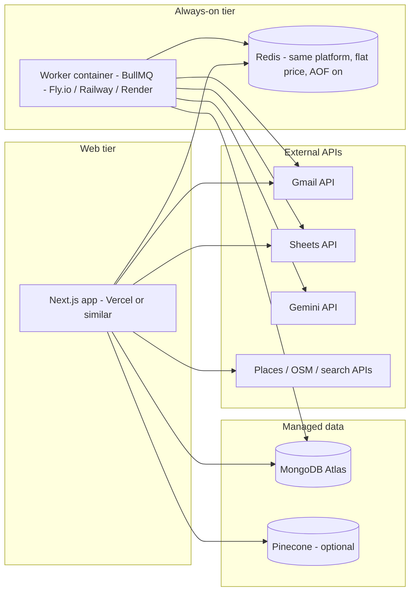

| Component | Recommendation | Notes |
|---|---|---|
| Web | Vercel (or Cloudflare/Fly/Railway running `next start`) | ⚠ VERIFY: free "hobby" plans on some hosts restrict **commercial** use — a freelance business tool may need a paid plan; self-hosting the whole app on the same small host as the worker is a valid low-cost option |
| Worker | **Separate always-on container** (1 small instance) | Required: BullMQ needs persistent connection; same repo, `Dockerfile.worker`, `node dist/worker/index.js` |
| Redis | Co-located with worker (private network), flat-price, persistence on | Avoid per-command-priced Redis for BullMQ |
| MongoDB | Atlas free/shared tier to start → small dedicated when needed | Enable backups before real data; IP allowlist/peering |
| Pinecone | Only when `FEATURE_VECTOR=true` | |
| Secrets | Host secret manager; separate dev/staging/prod OAuth clients & keys | |
| CI/CD | GitHub Actions: test → build → deploy web; build/push worker image → deploy worker | Run DB index check on deploy |
| Domains | One app domain; set OAuth redirect URIs exactly | Needed for production OAuth + unsubscribe links |
| Observability | Sentry + structured logs + Bull Board (auth-protected) + uptime check | |
| Backups/DR | Atlas backups; export `ContactLedger` + `SuppressionEntry` regularly (compliance-critical) | |

**Runtime split rule:** anything that must run while the browser is closed (sending, sheet flush, inbox sync schedule) runs in the **worker**. Everything request/response runs in the **web tier**.

---

## 27. Future Scalability

| Area | Now (MVP) | Later |
|---|---|---|
| Users | Single user / few users | Multi-tenant: `userId` → `workspaceId`, roles, per-workspace limits |
| Gmail sending | One Gmail account | Multiple sender accounts with per-account limits (still no limit-evasion); Google Workspace/SMTP provider behind `EmailProvider` interface |
| Gmail read | On-demand incremental sync | Gmail **push notifications** (Pub/Sub watch + webhook) to eliminate polling |
| Queue | Single worker | Multiple workers (design already idempotent/locked); separate Redis for cache vs queue |
| Lead sources | 2–3 providers | New providers via registry; provider marketplace; scheduled refreshes |
| AI | Flash-class, batch | Fine-tuned prompts using `userOverrideCategory` feedback as few-shot; embeddings for semantic dedupe |
| Vector | Off | Semantic lead search, similar-business discovery, reply-context retrieval |
| Analytics | Aggregates | Materialized rollups, warehouse export |
| Follow-ups | Manual explicit follow-up campaigns | Sequences with strict suppression + stop-on-reply (still user-approved) |
| Data | Mongo only | Archival of old logs to cold storage; read replicas |
| Compliance | Suppression + unsubscribe | Per-region rules engine, consent records, DPA/Privacy tooling |
| Public SaaS | Not targeted | Google restricted-scope verification, billing, org admin, audit export |

---

## 28. Package / Dependency Recommendations

Install only what the current phase needs (smaller bundle, fewer upgrades, lower risk).

| Category | Packages | Phase | Loaded where |
|---|---|---|---|
| Core | `next`, `react`, `react-dom`, `typescript` | 1 | both |
| Styling/UI | `tailwindcss`, `class-variance-authority`, `clsx`, `tailwind-merge`, `lucide-react`, Radix primitives (via shadcn), `next-themes`, `cmdk`, `sonner` | 1 | client |
| Animation | `gsap`, `@gsap/react`, `lenis` | 1 | client, **lazy** |
| Validation | `zod`, `react-hook-form`, `@hookform/resolvers` | 1 | both |
| Auth | `next-auth` (Auth.js v5), `@auth/prisma-adapter` | 2 | server |
| DB | `prisma`, `@prisma/client` | 3 | server |
| Client data | `@tanstack/react-query`, `@tanstack/react-table`, `@tanstack/react-virtual` | 4 | client |
| Data utils | `papaparse`, `xlsx` (dynamic import), `libphonenumber-js`, `date-fns` (or `date-fns-tz`), `nanoid` | 4 | server/lazy client |
| Google | `google-auth-library`, `@googleapis/gmail`, `@googleapis/sheets` (or `googleapis`) | 5–7 | server |
| Redis/Queue | `ioredis`, `bullmq`, `@bull-board/api` (+ adapter) | 8 | server/worker |
| AI | `@langchain/core`, `@langchain/google-genai` | 10 | server/worker |
| Vector (opt.) | `@pinecone-database/pinecone` | later | server |
| HTML safety | `dompurify`/`isomorphic-dompurify`, `html-to-text`, `mailparser` or `mimetext` (MIME building) | 6–7 | server |
| Web fetch | `undici` (built-in fetch), `robots-parser`, `cheerio` | 4 (opt.) | server |
| Logging/monitoring | `pino`, `pino-pretty` (dev), `@sentry/nextjs` | 1/12 | server |
| Charts | `recharts` (dynamic import) | 11 | client, lazy |
| Worker build | `tsup`, `tsx` | 8 | dev |
| Testing | `vitest`, `@playwright/test`, `msw`, `testcontainers` (or `mongodb-memory-server`), `@testing-library/react` | 1+ | dev |
| Quality | `eslint`, `prettier`, `dependency-cruiser`, `husky`, `lint-staged`, `@next/bundle-analyzer` | 1 | dev |

---

## 29. Open Decisions & Risks

| # | Item | Why it matters | Suggested resolution |
|---|---|---|---|
| 1 | **Google Places terms for storing/exporting data** | May restrict persistent storage and Sheets export | Verify terms before building the Places provider; default MVP to OSM/CSV/directories (§12.5) |
| 2 | **OAuth consent screen status** | "Testing" can expire refresh tokens (~7 days) and cap users | Move to "In production" for personal use; plan verification only if going public |
| 3 | **`gmail.readonly` is a restricted scope** | Public distribution needs verification/security assessment | Fine for personal use; budget time if you open it to others |
| 4 | **Gmail sending limits & reputation** | Exceeding limits or high bounce/complaint rates can suspend the account | Conservative default cap (25/day), warm-up, breaker, valid-address checks; consider a dedicated sending domain/mailbox for cold outreach to protect your primary inbox |
| 5 | **Deliverability** | Cold email from a personal mailbox can land in spam | SPF/DKIM/DMARC on your domain if using Workspace; plain-text-leaning copy; honest content |
| 6 | **Cold-email law by region** | Different rules for UK/EU/CA/US recipients | Confirm per target country; restrict campaign targeting by country if needed (add `allowedCountries` setting) |
| 7 | **Gemini tier & data usage terms** | Inbox content privacy | Use a paid tier with no-training terms for inbox content (⚠ VERIFY) |
| 8 | **Hosting plan commercial-use terms** | Free tiers may forbid commercial use | Verify before launch |
| 9 | **Next.js / Prisma-on-Mongo version compatibility** | Mongo support/behavior differs by version | Pin versions in Phase 1/3; read release notes before upgrading |
| 10 | **Worker as single point of failure** | Sending stops if it's down | Health alert + restart policy; system is idempotent so restart is safe |

---

### Appendix A — Module independence checklist (for code review)

- [ ] `modules/leads` imports nothing from `modules/campaigns` or `modules/inbox` (and vice-versa).
- [ ] Campaign creation works with an empty `Lead` collection (CSV/Sheet only).
- [ ] Inbox works with zero campaigns and no Sheets scope.
- [ ] Lead Generator works with no Gmail scope and no Redis.
- [ ] Each module's Google requirement is checked via `scopes`, with a graceful "Connect" prompt.
- [ ] Deleting a feature folder + server module + routes removes a module without compile errors elsewhere.

### Appendix B — "Definition of Done" for the sending pipeline

- [ ] No endpoint can send an email except via campaign → queue → `processOne`.
- [ ] Daily limit enforced atomically server-side; verified by concurrency test.
- [ ] All four duplicate layers present and tested.
- [ ] Suppression checked at import, start and send time.
- [ ] Unsubscribe link + postal address + accurate sender in every email.
- [ ] Crash-after-send reconciliation implemented and tested.
- [ ] Sheet updates batched through the outbox; Sheets outage never blocks sending.
- [ ] Auto-pause on token failure and failure/bounce spike.
- [ ] Fail-closed on Redis/DB uncertainty.
- [ ] Audit log entries for start/pause/resume/disconnect/export.

*End of blueprint.*
